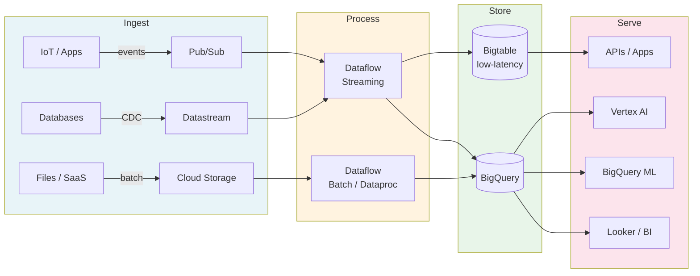

# GCP Professional Data Engineer — Elite Study Guide


> **The only GCP Data Engineer study resource you need.** Crisp architecture diagrams, comparison matrices, exam-style deconstructions, and battle-tested cheat sheets — designed for engineers who respect their time.

---

## Why This Guide?

Most study guides dump documentation at you. This one **teaches you to think** like a GCP data engineer:

- **Visual-first**: Every architecture is a Mermaid diagram, not a paragraph
- **Exam-traps flagged**: Common distractors explained with *why they fail*
- **Decision frameworks**: "When to use X vs Y" for every service pair that appears on the exam
- **Cheat sheets**: One-page quick references for exam day

---

## Exam Blueprint (2024–2025)

| Domain | Weight |
|---|---|
| Designing data processing systems | ~22% |
| Ingesting and processing data | ~25% |
| Storing data | ~20% |
| Preparing and using data for analysis | ~15% |
| Maintaining and automating data workloads | ~18% |

---

## Learning Roadmap

```
Week 1           Week 2           Week 3           Week 4
────────         ────────         ────────         ────────
Ingestion   ──►  Storage     ──►  Processing  ──►  ML + MLOps
Pub/Sub          BigQuery         Dataflow         Vertex AI
Dataflow         Bigtable         Spark            Feature Store
Cloud DQ         Spanner          Dataproc         Pipelines
                 GCS              BigQuery ML      Model Registry
                                                   Security &
                                                   Governance
```

---

## Table of Contents

### Modules

| # | Module | Key Services | Status |
|---|--------|-------------|--------|
| 01 | [Ingestion & Pipeline Orchestration](modules/01-ingestion-orchestration/README.md) | Pub/Sub, Dataflow, Cloud Composer, Eventarc | ✅ |
| 02 | [Storage & Data Warehousing](modules/02-storage-warehousing/README.md) | BigQuery, Bigtable, Spanner, GCS, Firestore | ✅ |
| 03 | [Processing & Analytics](modules/03-processing-analytics/README.md) | Dataflow, Dataproc, BigQuery ML, Looker | ✅ |
| 04 | [ML & MLOps](modules/04-ml-ops/README.md) | Vertex AI, Feature Store, Model Registry, Pipelines | ✅ |
| 05 | [Security & Compliance](modules/05-security-compliance/README.md) | IAM, VPC-SC, CMEK, DLP, Data Catalog | ✅ |

### Cheat Sheets

| Sheet | Coverage |
|-------|----------|
| [Service Selector](cheat-sheets/service-selector.md) | When to use which storage/processing service |
| [BigQuery Limits & Gotchas](cheat-sheets/bigquery-limits.md) | Partition limits, slot quotas, DML constraints |
| [Streaming vs Batch Decision Tree](cheat-sheets/streaming-vs-batch.md) | Latency-cost trade-off framework |
| [IAM Quick Reference](cheat-sheets/iam-quick-ref.md) | Predefined roles for every data service |
| [Exam Day Cheat Sheet](cheat-sheets/exam-day.md) | One-pager: limits, gotchas, mnemonics |

---

## Architecture: The Standard GCP Data Platform



---

## How to Use This Guide

1. **Sequential learners**: Follow modules 01 → 05 in order
2. **Targeted review**: Jump to any module's comparison matrix or cheat sheet
3. **Exam week**: Read only the `cheat-sheets/` directory

---

## Contribution

Pull requests are welcome. Please open an issue first for major additions.

**Content standard**: Every PR must include a "When to use" section, at least one diagram, and one exam-style question.

---

## License

MIT © [Sohail Tanveer](https://github.com/Sohailtanveer1)

---

> *"The exam tests architecture judgment, not memorization. This guide teaches judgment."*
