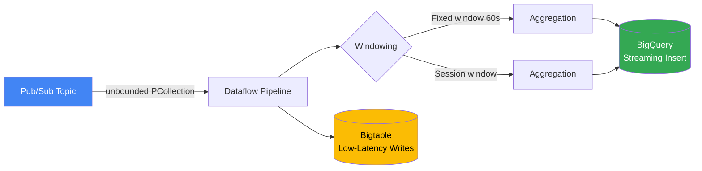
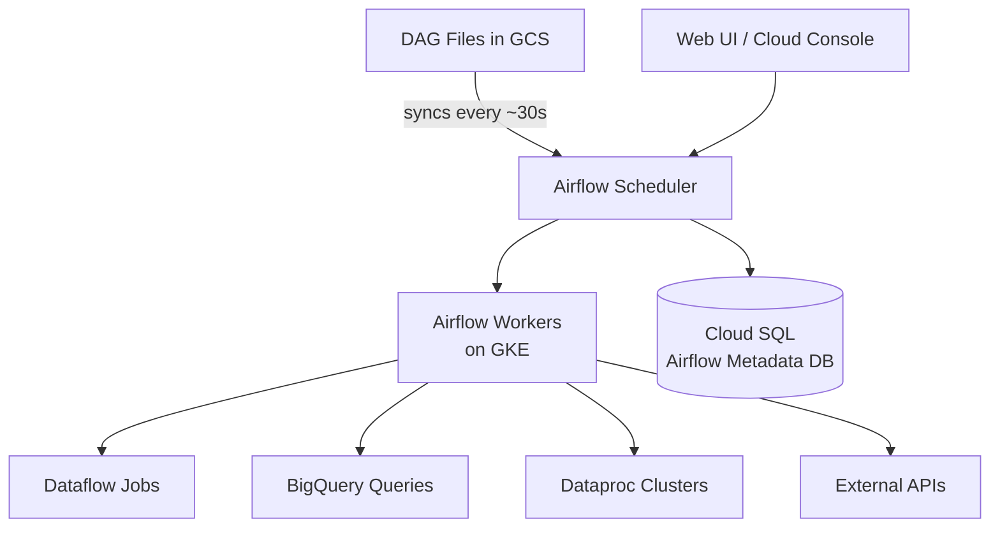
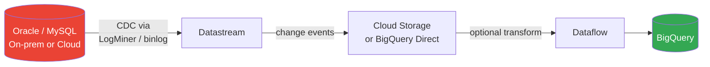
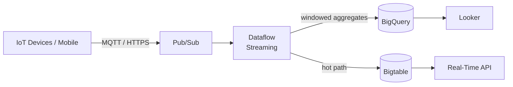
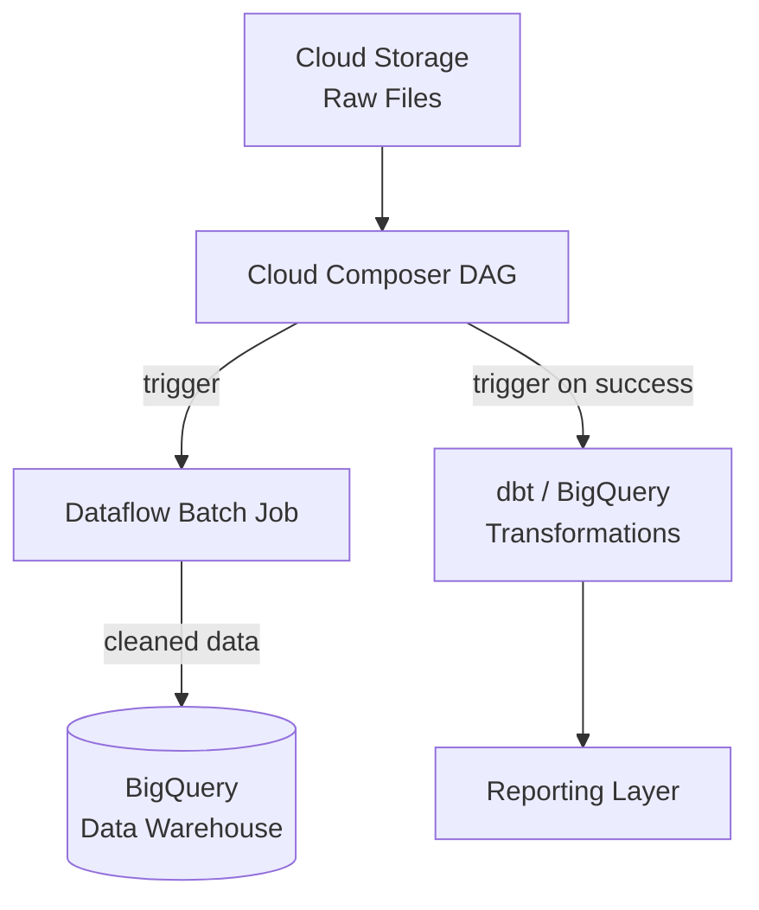
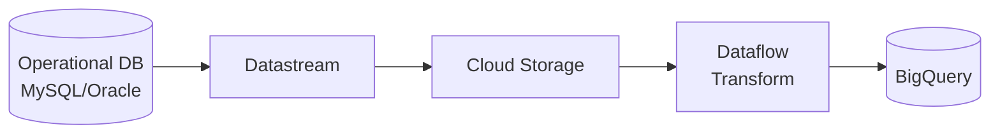

# Module 01 — Data Ingestion & Pipeline Orchestration

> **Exam weight: ~25%** | Services covered: Cloud Pub/Sub, Pub/Sub Lite, Dataflow, Cloud Composer, Eventarc, Datastream

---

## Quick Navigation

- [Pub/Sub vs Pub/Sub Lite](#pubsub-vs-pubsub-lite)
- [Dataflow Deep Dive](#dataflow-deep-dive)
- [Cloud Composer (Airflow)](#cloud-composer)
- [Datastream (CDC)](#datastream-cdc)
- [Eventarc](#eventarc)
- [Architecture Patterns](#architecture-patterns)
- [Exam Deconstructions](#exam-deconstructions)
- [Cheat Sheet](#module-cheat-sheet)

---

## Pub/Sub vs Pub/Sub Lite

### Mental Model

```
Pub/Sub      = Fully managed, global, exactly-once capable, no capacity planning
Pub/Sub Lite = Zone-local, you pre-provision capacity, 90% cheaper at scale
```

### Comparison Matrix

| Dimension | Cloud Pub/Sub | Pub/Sub Lite |
|-----------|--------------|--------------|
| Delivery guarantee | At-least-once (exactly-once with Dataflow) | At-least-once |
| Ordering | Per-ordering-key | Per-partition |
| Geo-redundancy | Multi-region by default | Zonal or regional |
| Retention | 7 days max | Configurable (unlimited with storage) |
| Capacity planning | Automatic | Manual (throughput units) |
| Price model | Per-message/GB | Pre-provisioned capacity |
| Best for | Variable traffic, global fan-out | High-volume, cost-sensitive, predictable workloads |
| Typical use | Event-driven microservices, IoT ingestion | Log aggregation, financial tick data at scale |

> **Exam trap**: The exam often presents cost-optimization scenarios for *predictable*, *high-volume* pipelines. Pub/Sub Lite is the answer when traffic is stable. Never choose Lite when global delivery or ordering across regions is required.

### When to Choose Pub/Sub

- Unknown or spiky traffic patterns
- Global subscriber fanout (multi-region consumers)
- Exactly-once processing required (pair with Dataflow)
- Simplicity is valued over cost optimization

### When to Choose Pub/Sub Lite

- Predictable, sustained high-throughput workloads (> 1 GB/s)
- Cost is the primary constraint (up to 90% cheaper)
- Single-zone or single-region consumers are acceptable
- You can tolerate manual capacity management

---

## Dataflow Deep Dive

### What It Is

Dataflow is a **fully managed, serverless** Apache Beam runner. It handles both **streaming** and **batch** with the same pipeline code. The key value: auto-scaling, exactly-once processing (with Pub/Sub), and no cluster management.

### Core Concepts

```
PCollection  → Immutable, distributed dataset (bounded = batch, unbounded = streaming)
PTransform   → Operation on a PCollection (ParDo, GroupByKey, Combine, Flatten)
Pipeline     → DAG of PTransforms
Runner       → Execution engine (Dataflow runner = GCP managed service)
```

### Streaming Architecture



### Windowing — Exam Critical

| Window Type | Definition | When to Use |
|-------------|-----------|-------------|
| Fixed | Non-overlapping, fixed-duration | Hourly reports, batching |
| Sliding | Overlapping windows | Moving averages, rolling metrics |
| Session | Gap-based, activity-driven | User session analytics |
| Global | One window for all data | Exactly-once aggregation across all time |

> **Pro-tip**: The exam loves lateness handling. Know the difference between `allowedLateness` (how late data is still processed) and `triggers` (when results are emitted).

### Dataflow Flex Templates vs Classic Templates

| | Classic Templates | Flex Templates |
|--|------------------|----------------|
| Packaging | Staged JSON + metadata | Docker container |
| Runtime params | Limited, pre-defined | Fully dynamic |
| Custom dependencies | Hard to include | Easy (Dockerfile) |
| Startup time | Faster | Slightly slower |
| Recommendation | Legacy use cases | **Preferred for new pipelines** |

### Auto-scaling

- **Horizontal**: Workers added/removed based on backlog and CPU
- **Vertical**: Worker machine type optimized by Dataflow
- **Streaming Engine**: Moves windowing state off worker VMs → reduces cost and improves scaling

> **Exam trap**: "Streaming Engine" is a Dataflow feature, not a separate GCP service. Enable it with `--enable_streaming_engine`. It decouples state from workers, enabling faster scale-in.

---

## Cloud Composer

### What It Is

Cloud Composer is **managed Apache Airflow** on GCP. Use it when you need **workflow orchestration with dependencies** — not just event-driven triggers.

### Architecture



### Composer 1 vs Composer 2

| | Composer 1 | Composer 2 |
|--|-----------|-----------|
| Infrastructure | GKE + fixed VMs | GKE Autopilot |
| Scaling | Manual node count | Auto-scales to zero |
| Cost | Always-on workers | Pay-per-use |
| Startup time | N/A | Slightly longer for cold start |
| Recommendation | Legacy | **Use Composer 2** |

### When to Use Composer vs Alternatives

| Use Case | Recommended Tool |
|----------|-----------------|
| Complex multi-step DAG with retries & SLAs | **Cloud Composer** |
| Simple scheduled BigQuery query | BigQuery Scheduled Queries |
| Event-driven, serverless trigger | **Eventarc** |
| ML pipeline with reusable components | **Vertex AI Pipelines** |
| Real-time, continuous pipeline | **Dataflow** |

> **Exam trap**: Cloud Composer is overkill for a single scheduled query. If the scenario mentions "scheduling a daily BigQuery export," the answer is BigQuery Scheduled Queries, not Composer.

---

## Datastream (CDC)

### What It Is

Datastream is a **serverless change data capture (CDC)** and replication service. It streams changes from operational databases into GCP analytics systems with minimal latency.

### Supported Sources

- MySQL, PostgreSQL, Oracle, SQL Server (AlloyDB via PostgreSQL protocol)

### Supported Destinations

- Cloud Storage (Avro/JSON), BigQuery (direct), Dataflow (for transformation)

### Architecture Pattern: DB to BigQuery



> **Pro-tip**: Datastream uses **log-based CDC** (not trigger-based), so it has minimal impact on source database performance. This is a common exam differentiator vs. custom JDBC replication.

---

## Eventarc

### What It Is

Eventarc routes **events from GCP services, third-party SaaS, and custom sources** to Cloud Run, Cloud Functions, GKE, or Workflows — without managing infrastructure.

### Event Sources

- **Direct**: Cloud Storage, BigQuery, Pub/Sub, Artifact Registry, Cloud SQL, etc.
- **Audit Log-based**: Any GCP service that writes to Cloud Audit Logs
- **Custom**: Your own Pub/Sub topics

### When to Use

- Trigger a Cloud Run function when a file lands in GCS
- Automate responses to BigQuery table creation events
- Chain GCP services in an event-driven architecture without Composer overhead

> **Exam trap**: Eventarc ≠ Pub/Sub. Eventarc is an *event routing* layer. Pub/Sub is the *messaging* layer underneath. Eventarc can route Pub/Sub messages, but it adds routing rules, filtering, and managed delivery on top.

---

## Architecture Patterns

### Pattern 1: Real-Time Analytics Pipeline



### Pattern 2: Batch ETL with Orchestration



### Pattern 3: CDC to Analytics



---

## Exam Deconstructions

### Question 1 — Ordering & Fan-out

**Scenario**: A financial services company ingests 500,000 trade events per second globally. Each event must be delivered to 3 downstream consumers. Trade events for the same instrument must be processed in order. The pipeline must survive a regional outage.

**What would you choose?**
- A) Pub/Sub Lite with partition ordering
- B) Cloud Pub/Sub with ordering keys and 3 subscriptions
- C) Pub/Sub Lite with 3 subscriptions
- D) Kafka on GKE

**Answer: B**

| Option | Why it fails / succeeds |
|--------|------------------------|
| **A** | Pub/Sub Lite is *zonal* — fails the regional outage requirement |
| **B** ✅ | Pub/Sub ordering keys guarantee per-instrument order; 3 subscriptions = 3 consumers; global = survives regional outage |
| **C** | Lite is zonal; also regional outage not survived |
| **D** | Kafka on GKE is self-managed — no reason to choose it when Pub/Sub meets all requirements |

---

### Question 2 — Dataflow Lateness

**Scenario**: A Dataflow streaming pipeline aggregates website clicks into 5-minute fixed windows to compute page-view counts. Due to mobile network delays, some events arrive up to 10 minutes late. The team can tolerate slightly stale results but must eventually get accurate counts.

**What configuration handles this correctly?**
- A) Set `allowedLateness(Duration.standardMinutes(10))` and use an accumulating trigger
- B) Set window size to 15 minutes to absorb late data
- C) Drop late data with a filter in the pipeline
- D) Use session windows instead of fixed windows

**Answer: A**

| Option | Why it fails / succeeds |
|--------|------------------------|
| **A** ✅ | `allowedLateness` holds state open for late arrivals; accumulating trigger fires early results and corrects them as late data arrives |
| **B** | Increasing window size doesn't solve lateness — data arriving 10 min late in a 15-min window is still late |
| **C** | Explicitly violates "must eventually get accurate counts" |
| **D** | Session windows are gap-based; they don't solve network-delay lateness for page-view aggregation |

---

## Module Cheat Sheet

```
┌─────────────────────────────────────────────────────────────────┐
│              INGESTION & ORCHESTRATION — EXAM CHEAT SHEET       │
├──────────────────────────┬──────────────────────────────────────┤
│ Pub/Sub                  │ Global, auto-scale, event streaming  │
│ Pub/Sub Lite             │ Zonal, cheap, pre-provision capacity │
│ Dataflow                 │ Managed Beam, batch+stream, exactly- │
│                          │ once with Pub/Sub                   │
│ Cloud Composer           │ Managed Airflow, complex DAGs        │
│ Datastream               │ CDC from MySQL/PG/Oracle → BQ/GCS   │
│ Eventarc                 │ Event routing from any GCP service   │
├──────────────────────────┼──────────────────────────────────────┤
│ GOTCHAS                  │                                      │
│ Pub/Sub Lite             │ Zonal only — fails HA scenarios      │
│ Composer                 │ Overkill for a single scheduled job  │
│ Dataflow Streaming Eng.  │ Not a service — it's a flag          │
│ Datastream latency       │ Seconds, not milliseconds            │
│ Flex Templates           │ Preferred over Classic for new work  │
└──────────────────────────┴──────────────────────────────────────┘
```

---

**Next Module →** [02 — Storage & Data Warehousing](../02-storage-warehousing/README.md)
