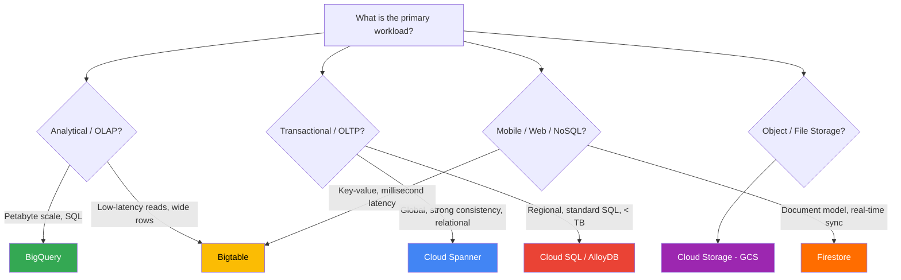
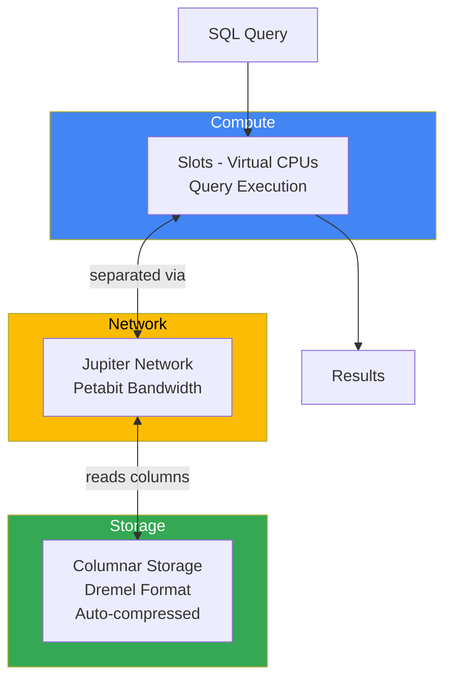
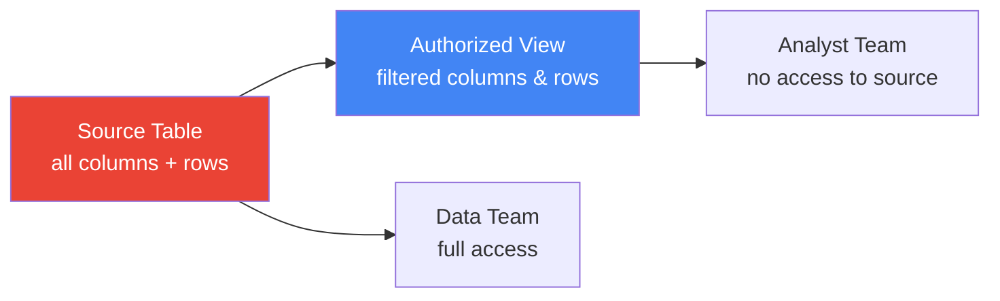
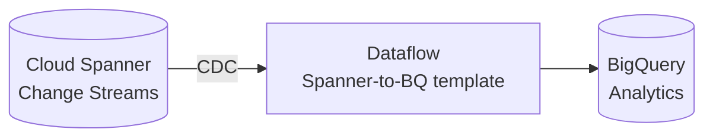
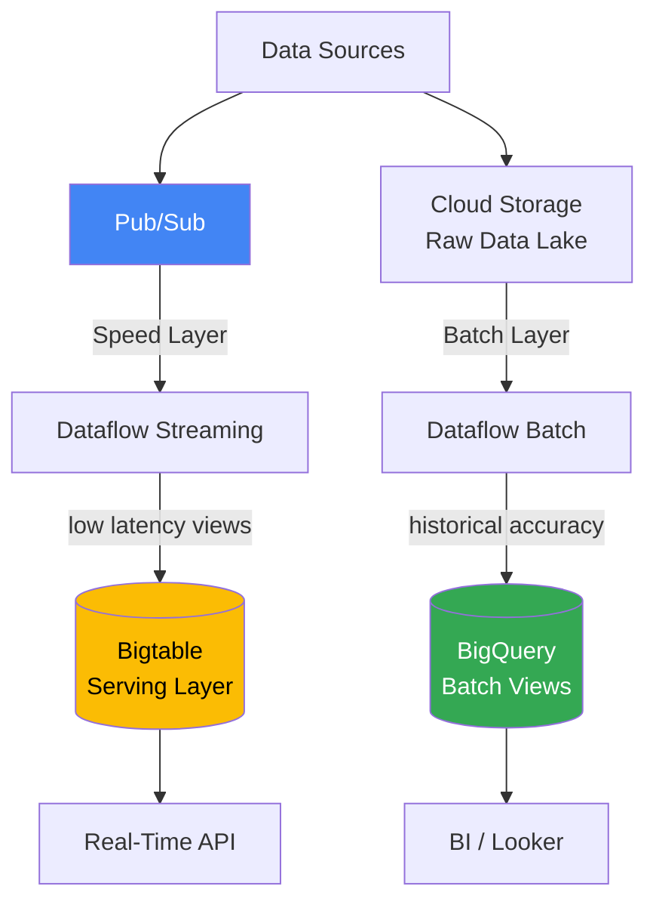
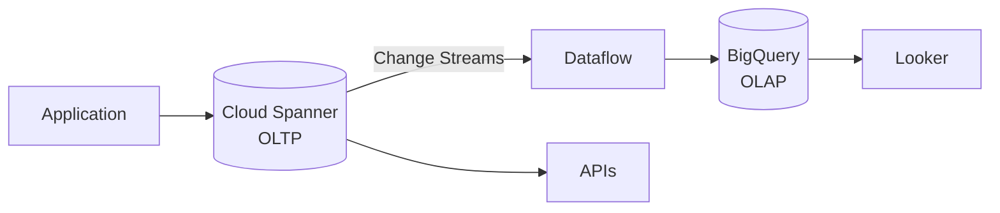
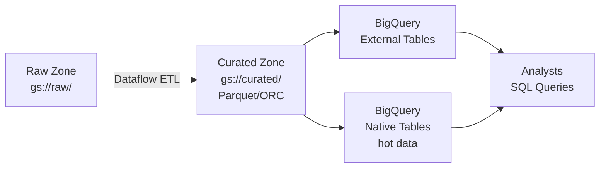

# Module 02 — Storage & Data Warehousing

> **Exam weight: ~20%** | Services covered: BigQuery, Cloud Bigtable, Cloud Spanner, Cloud Storage, Firestore, Cloud SQL, AlloyDB

---

## Quick Navigation

- [The Storage Decision Framework](#the-storage-decision-framework)
- [Cloud Storage (GCS)](#cloud-storage-gcs)
- [BigQuery — Data Warehouse](#bigquery--data-warehouse)
- [Cloud Bigtable](#cloud-bigtable)
- [Cloud Spanner](#cloud-spanner)
- [Cloud SQL & AlloyDB](#cloud-sql--alloydb)
- [Firestore](#firestore)
- [Cross-Service Comparison Matrix](#cross-service-comparison-matrix)
- [Architecture Patterns](#architecture-patterns)
- [Exam Deconstructions](#exam-deconstructions)
- [Module Cheat Sheet](#module-cheat-sheet)

---

## The Storage Decision Framework

Use this flowchart **before** every storage question on the exam:



---

## Cloud Storage (GCS)

### Storage Classes — Exam Critical

| Class | Min Storage Duration | Access Frequency | Use Case |
|-------|---------------------|-----------------|----------|
| **Standard** | None | Frequent | Hot data, serving, staging |
| **Nearline** | 30 days | < 1x/month | Monthly backups, archives |
| **Coldline** | 90 days | < 1x/quarter | Quarterly DR snapshots |
| **Archive** | 365 days | < 1x/year | Long-term regulatory archives |

> **Exam trap**: Retrieval costs scale: Archive >> Coldline >> Nearline >> Standard. Early deletion charges apply if you delete before the minimum duration. A file in Archive deleted after 100 days is charged for 265 more days.

### Object Lifecycle Management


> **Pro-tip**: Lifecycle rules can only **downgrade** storage class (Standard → Nearline), not upgrade. If a Nearline object is accessed frequently, GCS does NOT auto-promote it — you must do that manually or via application logic.

### Consistency & Access Patterns

- **Strong consistency** for all operations (read-after-write, list-after-write) since 2021
- **Uniform Bucket-Level Access (UBAC)**: Disables per-object ACLs, enforces IAM-only — required for VPC Service Controls
- **Signed URLs**: Temporary, time-limited access for unauthenticated users; scoped to a specific object+action

### GCS for Data Engineering

| Pattern | GCS Role |
|---------|----------|
| Data lake landing zone | Raw ingestion bucket (append-only) |
| Dataflow staging | Temp bucket for job state |
| BigQuery external tables | GCS as backing store (Parquet/ORC/CSV) |
| Dataproc input/output | HDFS replacement via `gs://` |
| ML training data | Training datasets for Vertex AI |

---

## BigQuery — Data Warehouse

### Architecture Overview



**Key insight**: Storage and compute are **decoupled**. You pay for storage always; compute only when querying (on-demand) or reserved (capacity slots).

### Partitioning — Exam Critical

| Partition Type | Column Type | Max Partitions | Use Case |
|---------------|------------|----------------|----------|
| Ingestion-time | Auto (`_PARTITIONTIME`) | 4,000 | Append pipelines |
| Time-unit column | DATE, TIMESTAMP, DATETIME | 4,000 | Event timestamps |
| Integer range | INTEGER | 10,000 | Customer ID ranges |

> **Exam trap — Partition Limit**: BigQuery tables have a **hard limit of 4,000 partitions** (time-based). If your pipeline creates daily partitions, that's ~11 years of data before you hit the limit. For higher cardinality, use integer-range partitioning or cluster instead.

> **Pro-tip**: Always filter on the partition column in `WHERE` clauses. Without it, BigQuery scans all partitions — no cost benefit from partitioning.

### Clustering

- Up to **4 clustering columns** per table
- Works *inside* each partition — sorts data on disk
- Best for: columns used in `WHERE`, `JOIN`, `GROUP BY` after the partition filter
- **No extra cost** — clustering is free; it just reorganizes storage

```sql
CREATE TABLE `project.dataset.events`
PARTITION BY DATE(event_timestamp)
CLUSTER BY user_id, event_type
AS SELECT * FROM source_table;
```

### Slot Pricing Models

| Model | How It Works | Best For |
|-------|-------------|----------|
| **On-demand** | $6.25 per TB scanned | Ad-hoc, unpredictable workloads |
| **Capacity (Standard)** | $0.04/slot-hour, autoscale | Mixed, predictable + spiky |
| **Capacity (Enterprise)** | Commitments (1yr/3yr discounts) | High, consistent throughput |
| **BigQuery ML** | Included in query costs | Model training in SQL |

### Authorized Views & Row/Column Security



- **Authorized Views**: Share query results without exposing underlying tables — the view runs with the *table owner's* permissions
- **Column-level security**: Apply `Policy Tags` from Data Catalog; users without the `Fine-grained Reader` role see `NULL` for masked columns
- **Row-level security**: `Row Access Policies` filter rows based on `SESSION_USER()` — no view needed

> **Exam scenario**: Multi-tenant analytics where each customer's analysts can only see their own rows. Solution: **Row Access Policies** scoped to a tenant ID column, not separate tables per tenant.

### BigQuery Disaster Recovery

| Feature | RPO | RTO | Scope |
|---------|-----|-----|-------|
| Time Travel | 0 (point-in-time) | Minutes | Table-level (7 days default) |
| Table Snapshots | Configurable | Minutes | Table-level, low cost |
| Dataset copy (cross-region) | Near-zero (async) | Minutes | Dataset-level |
| Fail-safe | 7 days after Time Travel | Minutes | Automatic, no config |

> **Exam trap — Cross-Region DR**: BigQuery does NOT natively replicate across regions automatically. To achieve cross-region DR with tight RPO, you must set up **scheduled dataset copies** or use **BigQuery Omni** for federated reads. The exam may present this as a gotcha.

### BigQuery ML — When to Use

```
SQL-only team, needs quick model → BigQuery ML
Feature engineering in SQL → BigQuery ML
Production-grade model, custom architecture → Vertex AI
Large neural network, GPU required → Vertex AI Training
```

Supported model types in BQML: Linear regression, Logistic regression, K-Means, Time series (ARIMA+), Boosted trees (XGBoost), DNN classifier/regressor, Imported TF/PyTorch models.

---

## Cloud Bigtable

### What It Is

Bigtable is a **petabyte-scale, low-latency NoSQL wide-column store**. It's the same technology powering Google Search, Maps, and Gmail. Use it when you need millisecond reads/writes at massive scale.

### Data Model

```
Table
└── Row Key  (only indexed dimension — design this carefully!)
    ├── Column Family A
    │   ├── column:qualifier → cell (value + timestamp)
    │   └── column:qualifier → cell
    └── Column Family B
        └── column:qualifier → cell (multiple versions by timestamp)
```

> **The #1 Bigtable exam principle**: **All queries filter by row key.** There are no secondary indexes, no joins, no SQL. Design your row key around your query pattern.

### Row Key Design — Exam Critical

| Anti-Pattern | Problem | Fix |
|-------------|---------|-----|
| Sequential timestamps as key | Hot-spotting on latest nodes | Reverse timestamp: `MAX_LONG - timestamp` |
| User ID alone | Low cardinality, uneven distribution | Prefix with hash: `hash(user_id)#user_id` |
| Sequential integers | One node handles all writes | Salting: random prefix |

> **Exam trap**: A pipeline writing IoT sensor data keyed by `sensor_id#timestamp` in ascending order will cause **hotspotting** — all writes land on one tablet server. Solution: reverse the timestamp or use a field-reversed composite key.

### Bigtable vs HBase

Bigtable is **API-compatible with Apache HBase**. This is an exam data point: existing HBase workloads can migrate to Bigtable with minimal code changes.

### Performance & Scaling

- **Nodes**: Minimum 1, scale linearly — each node handles ~10,000 QPS for reads or ~100,000 writes/s
- **Replication**: Multi-cluster replication within and across regions; eventual consistency
- **Storage**: SSD (low latency, recommended) or HDD (high throughput, bulk ingestion)

### When to Use Bigtable

| ✅ Good Fit | ❌ Poor Fit |
|------------|-----------|
| Time-series data (IoT, metrics) | Ad-hoc SQL analytics |
| User behavioral profiles (personalization) | Relational joins needed |
| Financial tick data | Transactions across rows |
| ML feature serving (low latency) | Small datasets (< 1 TB) — BigQuery cheaper |
| > 1 TB, > 1M rows/s write rate | |

---

## Cloud Spanner

### What It Is

Spanner is a **globally distributed, strongly consistent, relational database**. It uniquely combines the scalability of NoSQL with ACID transactions and SQL semantics — at global scale.

### The CAP Theorem Position

```
         Consistency
              ▲
              │
    Spanner ──┤ (uses TrueTime to achieve both C and P)
              │
Availability ◄────────────────► Partition Tolerance
```

Spanner achieves **external consistency** (stronger than serializable) using Google's TrueTime API — atomic clocks + GPS receivers in every data center.

### When to Use Spanner vs Alternatives

| Requirement | Service |
|-------------|---------|
| Global ACID transactions, relational | **Cloud Spanner** |
| Regional OLTP, PostgreSQL compatible | **AlloyDB / Cloud SQL** |
| Millisecond NoSQL, key-value | **Bigtable** |
| Petabyte analytics, SQL | **BigQuery** |
| < 10 TB, standard SQL, one region | **Cloud SQL** |

> **Exam trap**: Spanner is expensive. The exam won't ask you to use Spanner for a small regional workload. If the scenario says "global," "multi-region," "strong consistency," AND "relational" — that's Spanner. If it's just "relational + managed" without the global requirement, choose Cloud SQL or AlloyDB.

### Spanner Schema Design

- **Interleaving**: Store child rows physically adjacent to parent rows for efficient joins
- **No hot-spotting**: Avoid monotonically increasing PKs (use UUIDs or bit-reverse)
- **Change Streams**: Capture row-level changes for CDC → Dataflow → BigQuery



---

## Cloud SQL & AlloyDB

### Quick Comparison

| | Cloud SQL | AlloyDB |
|--|-----------|---------|
| Engine | MySQL, PostgreSQL, SQL Server | PostgreSQL-compatible only |
| Max storage | 64 TB | Unlimited (separated storage) |
| Read throughput | Up to 6 read replicas | Up to 16x faster reads than Cloud SQL PG |
| Columnar cache | No | Yes (built-in, for analytics) |
| HA | Regional (failover replica) | Regional (HA + read pools) |
| Use case | Standard OLTP, migrations | High-performance PostgreSQL, mixed OLTP+OLAP |
| Price | Lower | Higher |

> **When to choose AlloyDB over Cloud SQL**: The scenario mentions heavy read workloads on PostgreSQL, analytics queries on operational data, or needing > 64 TB.

---

## Firestore

### What It Is

Firestore is a **serverless, document-oriented NoSQL database** built for mobile and web applications. It provides real-time sync, offline support, and strong consistency.

### Data Model

```
Collection: /users
  └── Document: user_123
        ├── name: "Alice"
        ├── email: "alice@example.com"
        └── orders (sub-collection)
              └── Document: order_456
                    ├── total: 99.99
                    └── items: [...]
```

### Firestore vs Bigtable

| | Firestore | Bigtable |
|--|-----------|---------|
| Query model | Rich queries, indexes | Row key only |
| Scale | Millions of documents | Billions of rows, petabytes |
| Latency | Low (ms) | Very low (ms) |
| Transactions | ACID, multi-doc | Single-row only |
| Best for | Mobile/web apps, user data | Analytics, time-series, ML features |
| Pricing | Per document read/write | Per node/hour |

---

## Cross-Service Comparison Matrix

| Service | Scale | Latency | Consistency | SQL? | Best For |
|---------|-------|---------|-------------|------|---------|
| **BigQuery** | Petabyte | Seconds | Strong | ✅ Full | Analytics, DW |
| **Bigtable** | Petabyte | < 10ms | Eventual (replication) | ❌ | Time-series, IoT, features |
| **Spanner** | Petabyte | < 10ms | External (global) | ✅ Full | Global OLTP |
| **Cloud SQL** | 64 TB | < 10ms | Strong | ✅ Full | Regional OLTP |
| **AlloyDB** | Unlimited | < 10ms | Strong | ✅ Full | High-perf PostgreSQL |
| **Firestore** | TB | < 10ms | Strong | ❌ | Mobile/web, docs |
| **GCS** | Unlimited | 100ms | Strong | ❌ | Object storage, data lake |

---

## Architecture Patterns

### Pattern 1: Lambda Architecture (Batch + Speed Layer)



### Pattern 2: Operational + Analytics (HTAP)



### Pattern 3: Data Lake on GCS with BigQuery Overlay



---

## Exam Deconstructions

### Question 1 — Multi-Tenant Column Security

**Scenario**: A SaaS company stores all customers' data in a single BigQuery dataset. Customer A's analysts must never see Customer B's data. A compliance requirement also states that the `ssn` column must be hidden from all analysts regardless of customer — only the data engineering team can see it. The solution must scale to 500 customers without manual table management.

**What is the correct architecture?**
- A) Create a separate BigQuery dataset per customer; restrict IAM at the dataset level
- B) Create authorized views per customer that filter by `customer_id`; apply a Policy Tag to the `ssn` column
- C) Use Row Access Policies scoped to `customer_id`; apply a Policy Tag with Data Catalog to the `ssn` column
- D) Encrypt the `ssn` column with a customer-managed key (CMEK) per customer

**Answer: C**

| Option | Analysis |
|--------|---------|
| **A** | 500 datasets × future growth = massive operational overhead; doesn't handle `ssn` masking |
| **B** | Authorized views work but require creating/maintaining 500 views; Policy Tags ✅ but scaling ❌ |
| **C** ✅ | Row Access Policies = row-level filtering that auto-applies to `SESSION_USER()` — no 500 views needed. Policy Tags on `ssn` = column-level masking via Data Catalog taxonomy. Scales to N customers with no schema changes |
| **D** | CMEK encrypts data at rest; it does NOT control who can *query* the column. Decryption is transparent at the query layer |

---

### Question 2 — Bigtable vs BigQuery for IoT

**Scenario**: An energy company collects 50,000 sensor readings per second from 2 million smart meters. The application needs to: (1) look up the last 24 hours of readings for any given meter in under 50ms, (2) run weekly aggregate reports across all meters. What storage design best fits both requirements?

- A) BigQuery partitioned by `meter_id` for both use cases
- B) Bigtable with row key `meter_id#reverse_timestamp` for lookups; BigQuery for weekly reports
- C) Bigtable for both use cases
- D) Cloud Spanner for lookups; BigQuery for reports

**Answer: B**

| Option | Analysis |
|--------|---------|
| **A** | BigQuery latency is seconds, not milliseconds — fails the 50ms SLA for real-time lookups |
| **B** ✅ | Bigtable: row key `meter_id#reverse_timestamp` → prefix scan retrieves last 24h in ms. BigQuery: columnar analytics for weekly aggregates. Each tool optimized for its workload |
| **C** | Bigtable cannot run SQL aggregates efficiently across all meters; no GROUP BY, no SUM() |
| **D** | Spanner can do millisecond lookups but is expensive and unnecessary when Bigtable fits; Spanner shines for global transactions, not single-key IoT lookups |

---

### Question 3 — Cross-Region BigQuery DR

**Scenario**: A financial services firm runs its primary analytics workload in BigQuery `us-central1`. Regulatory requirements mandate an RPO of < 1 hour and RTO of < 30 minutes in case of regional failure. The dataset is 500 TB and updated continuously.

**What is the most cost-effective architecture?**
- A) Use BigQuery multi-region (`US`) dataset — it automatically replicates across regions
- B) Schedule hourly cross-region dataset copies from `us-central1` to `us-east1` using the BigQuery Data Transfer Service
- C) Use Time Travel to restore data after a regional failure
- D) Replicate all source data to GCS in `us-east1` and recreate BigQuery tables on failover

**Answer: B**

| Option | Analysis |
|--------|---------|
| **A** | Multi-region (`US`) replicates across US regions BUT doesn't give you control over which specific region becomes primary on failover, and it's ~2× the storage cost — not "most cost-effective" |
| **B** ✅ | Scheduled hourly copies satisfy RPO < 1 hour; a pre-existing `us-east1` dataset means RTO < 30 min (no rebuild). Cost: one extra dataset copy, targeted replication |
| **C** | Time Travel restores data within the *same* region — useless for a regional outage |
| **D** | Recreating 500 TB BigQuery tables from GCS on failover will take hours — violates RTO < 30 min |

---

## Module Cheat Sheet

```
┌─────────────────────────────────────────────────────────────────────┐
│              STORAGE & WAREHOUSING — EXAM CHEAT SHEET               │
├───────────────────────┬─────────────────────────────────────────────┤
│ SERVICE               │ KEY FACTS                                   │
├───────────────────────┼─────────────────────────────────────────────┤
│ GCS Archive           │ Min 365-day retention; highest retrieval $  │
│ GCS Nearline          │ Min 30-day; 1x/month access                 │
│ BigQuery partitions   │ Max 4,000 (time-based), 10,000 (int-range)  │
│ BigQuery clustering   │ Up to 4 cols; free; sorts inside partitions │
│ BigQuery Time Travel  │ Default 7 days; restores in same region     │
│ BigQuery column sec.  │ Policy Tags via Data Catalog taxonomy       │
│ BigQuery row sec.     │ Row Access Policies on SESSION_USER()       │
│ Bigtable row key      │ ONLY indexed dimension; design first        │
│ Bigtable hotspot fix  │ Reverse timestamp or salted prefix          │
│ Bigtable HBase compat │ API-compatible — key exam fact              │
│ Spanner TrueTime      │ External consistency via atomic clocks+GPS  │
│ Spanner hot spot fix  │ Avoid sequential PKs — use UUID             │
│ AlloyDB vs Cloud SQL  │ AlloyDB: high-perf PG, > 64 TB, analytics  │
│ Firestore vs Bigtable │ Firestore: docs/mobile; BT: time-series/ML │
├───────────────────────┼─────────────────────────────────────────────┤
│ GOTCHAS               │                                             │
│ BQ cross-region DR    │ NOT automatic — schedule copies manually    │
│ GCS lifecycle         │ Can only downgrade, not upgrade, class      │
│ CMEK                  │ Encrypts at rest — does NOT control queries │
│ Spanner cost          │ Expensive — only justify with global ACID   │
│ BQ multi-region       │ ~2× cost vs single-region                   │
└───────────────────────┴─────────────────────────────────────────────┘
```

---

**Previous Module ←** [01 — Ingestion & Orchestration](../01-ingestion-orchestration/README.md)
**Next Module →** [03 — Processing & Analytics](../03-processing-analytics/README.md)
