# Module 03 — Processing & Analytics

> **Exam weight: ~25% combined with ingestion** | Services covered: Dataflow (advanced), Dataproc, BigQuery ML, Looker, Dataplex, Data Fusion

---

## Quick Navigation

- [Processing Decision Framework](#processing-decision-framework)
- [Dataflow — Advanced Concepts](#dataflow--advanced-concepts)
- [Dataproc](#dataproc)
- [Dataflow vs Dataproc](#dataflow-vs-dataproc)
- [Data Fusion](#data-fusion)
- [BigQuery ML](#bigquery-ml)
- [Looker & Looker Studio](#looker--looker-studio)
- [Dataplex](#dataplex)
- [Architecture Patterns](#architecture-patterns)
- [Exam Deconstructions](#exam-deconstructions)
- [Module Cheat Sheet](#module-cheat-sheet)

---

## Processing Decision Framework

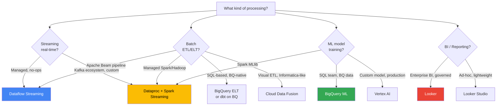

---

## Dataflow — Advanced Concepts

> Module 01 covered Dataflow basics. This section goes deeper on concepts that appear heavily in advanced exam questions.

### The Apache Beam Execution Model

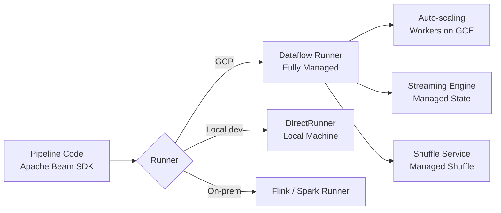

**Portability**: Write once in Beam SDK (Python, Java, Go), run on any runner. This is an exam differentiator vs. Spark (tied to Spark runtime).

### Side Inputs

Side inputs inject a secondary dataset into a `ParDo` transform — the main `PCollection` is the large stream; the side input is a small, read-only lookup dataset.

```python
# Pattern: enrich streaming events with a lookup table
enriched = main_stream | beam.ParDo(
    EnrichFn(),
    lookup_table=beam.pvalue.AsSingleton(lookup_pcollection)
)
```

> **When to use**: Real-time enrichment where the lookup dataset fits in memory on a worker (e.g., country codes, product catalog). If the lookup is too large → use Bigtable as external lookup instead.

### State & Timers API

Enables per-key stateful processing in streaming pipelines — critical for:
- **Deduplication**: Track seen event IDs per key
- **Session stitching**: Accumulate events into sessions without windowing
- **Watermark timers**: Fire aggregation when a key goes idle

```
ValueState  → Single value per key (e.g., running total)
BagState    → Append-only collection per key
MapState    → Key-value map per key
SetState    → Deduplicated set per key
Timer       → Fire a callback at event-time or processing-time
```

> **Exam trap**: If a scenario needs per-user deduplication in a streaming pipeline, the answer is **State API** (not windowing). Windowing groups by time; State API groups by key across time.

### Watermarks & Late Data

```
Event Time    = When the event actually occurred (in the data)
Processing Time = When Dataflow receives the event
Watermark     = Estimate of how far behind event time the pipeline is

allowedLateness(10 min) → Hold state open 10 min past the watermark
Trigger.AfterWatermark() → Emit result when watermark passes window end
Trigger.AfterProcessingTime() → Emit early (speculative) results
```

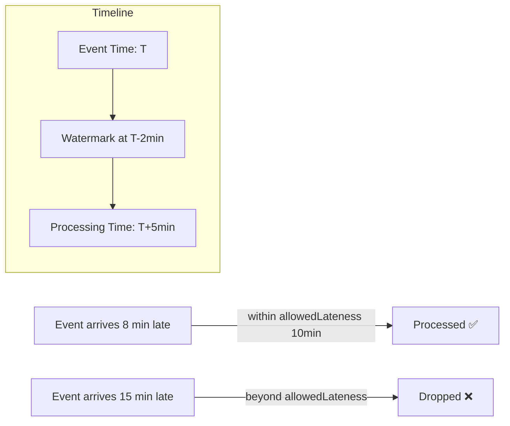

### Dataflow Shuffle Service

- Moves the shuffle step (GroupByKey, CoGroupByKey) **off worker VMs** onto managed infrastructure
- Reduces VM memory pressure, enables faster autoscaling, lowers cost
- Enable with: `--experiments=shuffle_mode=appliance`
- Combined with **Streaming Engine** → maximum efficiency for streaming pipelines

### Templates Deep Dive

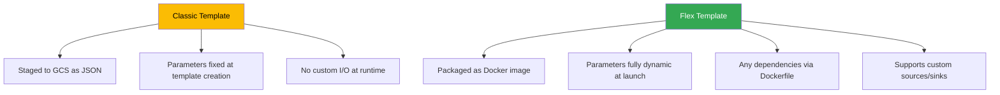

> **Exam rule**: Always prefer Flex Templates for new pipelines. Classic Templates exist for backward compatibility. If a scenario mentions "dynamic parameters" or "custom dependencies," it's Flex Templates.

---

## Dataproc

### What It Is

Dataproc is **managed Apache Spark and Hadoop** on GCP. It provisions clusters in ~90 seconds and integrates with GCS as the default filesystem (replacing HDFS).

### Cluster Lifecycle Patterns

| Pattern | Description | Use Case |
|---------|-------------|---------|
| **Ephemeral cluster** | Create → Run job → Delete | Cost-optimal for scheduled batch |
| **Long-running cluster** | Always-on | Interactive Spark (notebooks), streaming |
| **Dataproc Serverless** | No cluster management | Spark batch jobs, fully managed |

> **Key exam principle**: For batch ETL jobs, **ephemeral clusters are always preferred**. Pay only while the job runs. Store all data in GCS, not HDFS — clusters are stateless.

### Dataproc Serverless

- Submit PySpark/Spark jobs without provisioning a cluster
- Auto-scales resources per job
- No idle cluster cost
- Limitation: **batch only** (no streaming), Spark only (no Hive, Pig)

### Dataproc on GKE

Run Dataproc workloads on an existing GKE cluster — useful when:
- You already manage a GKE cluster and want to reuse it
- You need fine-grained K8s resource isolation
- You're running multiple workloads (Spark + non-Spark) on shared infrastructure

### Dataproc Metastore

- Fully managed **Apache Hive Metastore** compatible service
- Shared schema registry across Dataproc, BigQuery, Dataflow, and Spark
- Decouples metadata from compute — multiple clusters share one catalog

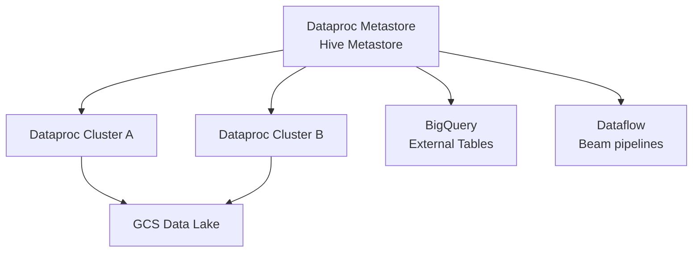

### Migration: On-Prem Hadoop → Dataproc

| On-Prem Component | GCP Equivalent |
|------------------|---------------|
| HDFS | Cloud Storage (GCS) |
| YARN | Dataproc cluster manager |
| Hive Metastore | Dataproc Metastore |
| Oozie | Cloud Composer |
| Hive queries | BigQuery (for analytics) |
| Spark MLlib | Vertex AI or Dataproc Spark ML |

---

## Dataflow vs Dataproc

This is the **most common processing trade-off question** on the exam.

| Dimension | Dataflow | Dataproc |
|-----------|---------|---------|
| Programming model | Apache Beam | Spark, Hadoop, Hive, Pig, Flink |
| Cluster management | None (serverless) | Required (or use Serverless Spark) |
| Streaming | First-class, unified model | Spark Streaming (micro-batch) |
| Existing codebase | Beam only | **Existing Spark/Hadoop code** ← key |
| Scaling | Fully automatic | Manual or autoscaling configured |
| Latency (streaming) | True streaming (per-event) | Micro-batch (seconds) |
| SQL support | SQL transforms in Beam | SparkSQL, HiveQL |
| Best for | New pipelines, serverless preference | Lift-and-shift, Spark/Hadoop teams |

> **Exam decision rule**: If the scenario says "the team has existing Spark jobs" or "migrate from on-prem Hadoop" → **Dataproc**. If it says "build a new streaming pipeline" or "no cluster management" → **Dataflow**.

---

## Data Fusion

### What It Is

Cloud Data Fusion is a **fully managed, visual ETL/ELT service** built on CDAP (open-source). It provides a drag-and-drop pipeline builder for non-engineers.

### When to Use Data Fusion

| ✅ Good Fit | ❌ Poor Fit |
|-----------|-----------|
| Business analysts building pipelines | Engineers who prefer code |
| Connecting 150+ pre-built connectors | Custom transforms needing code |
| Migrating from Informatica/Talend | Real-time streaming pipelines |
| Governance + lineage out of the box | Cost-sensitive (Data Fusion is pricey) |

> **Exam trap**: Data Fusion runs on Dataproc under the hood. It's not serverless — it provisions a Dataproc cluster per pipeline run. Factor this into cost comparisons.

### Data Fusion Editions

| Edition | Target | Features |
|---------|--------|---------|
| Developer | Dev/test | Limited connectors, single user |
| Basic | Small teams | 100+ connectors |
| Enterprise | Production | Streaming, lineage, replication, HA |

---

## BigQuery ML

### Model Types & SQL Syntax

```sql
-- Create a logistic regression model
CREATE OR REPLACE MODEL `project.dataset.churn_model`
OPTIONS(
  model_type = 'LOGISTIC_REG',
  input_label_cols = ['churned'],
  auto_class_weights = TRUE
) AS
SELECT * FROM `project.dataset.training_data`;

-- Evaluate
SELECT * FROM ML.EVALUATE(MODEL `project.dataset.churn_model`);

-- Predict
SELECT * FROM ML.PREDICT(
  MODEL `project.dataset.churn_model`,
  (SELECT * FROM `project.dataset.new_customers`)
);
```

### Full Model Type Matrix

| Model Type | SQL Option | Use Case |
|-----------|-----------|---------|
| Linear Regression | `LINEAR_REG` | Continuous value prediction |
| Logistic Regression | `LOGISTIC_REG` | Binary/multi-class classification |
| K-Means Clustering | `KMEANS` | Unsupervised segmentation |
| Time Series | `ARIMA_PLUS` | Demand forecasting, anomaly detection |
| XGBoost | `BOOSTED_TREE_CLASSIFIER` / `_REGRESSOR` | Tabular, competition-grade accuracy |
| DNN | `DNN_CLASSIFIER` / `_REGRESSOR` | Deep learning on tabular data |
| Matrix Factorization | `MATRIX_FACTORIZATION` | Collaborative filtering / recommendations |
| Imported TF/PyTorch | `TENSORFLOW` | Deploy externally trained models |
| AutoML Tables | `AUTOML_CLASSIFIER` / `_REGRESSOR` | Automated feature engineering |

### ML Functions Reference

```
ML.EVALUATE()     → Model metrics (accuracy, AUC, RMSE, etc.)
ML.PREDICT()      → Run inference on new data
ML.EXPLAIN_PREDICT() → SHAP feature attributions per prediction
ML.FEATURE_INFO() → Stats on training features
ML.CONFUSION_MATRIX() → Classification confusion matrix
ML.ROC_CURVE()    → Threshold analysis for classifiers
ML.TRAINING_INFO() → Loss curve per iteration
ML.TRANSFORM()    → Apply preprocessing to new data
```

> **Exam trap**: `ML.EXPLAIN_PREDICT()` uses **Shapley values (SHAP)** — the exam may ask about model explainability and this is the BQML answer. For Vertex AI, the equivalent is **Vertex Explainable AI**.

### ARIMA_PLUS for Time Series

```sql
CREATE OR REPLACE MODEL `project.dataset.sales_forecast`
OPTIONS(
  model_type = 'ARIMA_PLUS',
  time_series_timestamp_col = 'date',
  time_series_data_col = 'sales',
  auto_arima = TRUE,
  data_frequency = 'DAILY',
  decompose_time_series = TRUE  -- extracts trend + seasonality + residual
) AS
SELECT date, SUM(revenue) AS sales
FROM `project.dataset.transactions`
GROUP BY date;
```

> **Pro-tip**: `ARIMA_PLUS` automatically handles **holiday effects**, **seasonal decomposition**, and **multiple time series** (one model for all SKUs via `time_series_id_col`). Mention this in exam scenarios about demand forecasting at scale.

---

## Looker & Looker Studio

### Looker (Enterprise BI)

Looker is a **semantic layer + enterprise BI platform**. Its core concept is **LookML** — a modeling language that defines metrics, dimensions, and relationships once, so all downstream reports stay consistent.

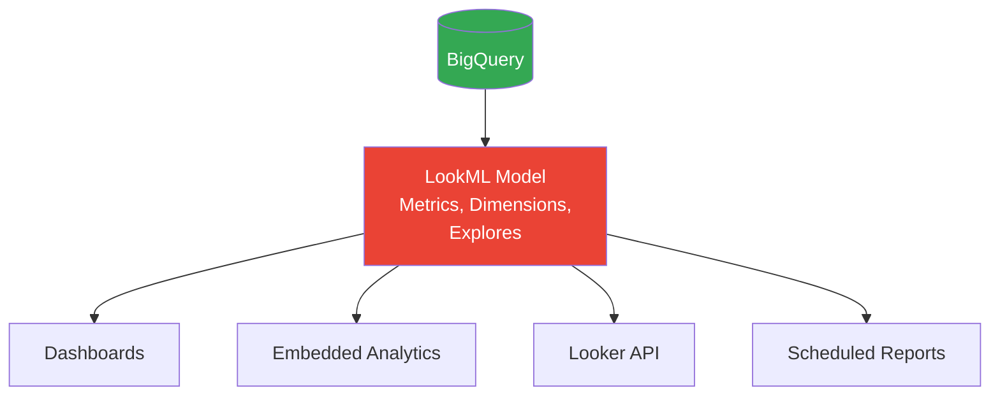

**Key LookML concepts for the exam**:

| Concept | Definition |
|---------|-----------|
| `explore` | Join definition — which views can be queried together |
| `view` | Maps to a table or derived SQL |
| `dimension` | A column/attribute (non-aggregated) |
| `measure` | An aggregated metric (SUM, COUNT, etc.) |
| `derived table` | SQL-defined virtual table within LookML |
| `persistent derived table (PDT)` | Derived table cached to BQ on a schedule |

> **Exam trap**: Looker queries BigQuery **at query time** via LookML (unless using PDTs). Looker does not store a copy of your data — it pushes SQL to BigQuery and renders results.

### Looker Studio (formerly Data Studio)

| | Looker | Looker Studio |
|--|--------|--------------|
| Target user | Enterprise analysts, data teams | Anyone |
| Semantic layer | LookML (governed) | None (ad-hoc) |
| Access control | Row/column level via LookML | Sharing link |
| Data freshness | Live query or PDT | Live query or extract |
| Embedding | Enterprise embedding API | iFrame sharing |
| Cost | Paid (per user) | Free |

> **When to choose Looker**: Governance, consistent metric definitions across teams, embedded analytics in a product.
> **When to choose Looker Studio**: Quick dashboard, personal use, no budget.

---

## Dataplex

### What It Is

Dataplex is GCP's **intelligent data fabric** — it organizes data across GCS, BigQuery, and other stores into a unified logical layer called a **Lake**, without physically moving data.

### Hierarchy

```
Dataplex Lake
└── Zone (Raw | Curated | other)
    └── Asset (BQ Dataset or GCS Bucket)
        └── Entities (Tables / Files discovered by auto-discovery)
```

### Core Capabilities

| Feature | Description |
|---------|-------------|
| **Auto-discovery** | Scans GCS/BQ assets, infers schemas, registers entities |
| **Data Quality** | Built-in DQ rules (completeness, uniqueness, validity) without custom code |
| **Lineage** | Tracks data movement across pipeline steps |
| **Unified metadata** | Single catalog view across BQ + GCS |
| **Data profiling** | Column-level statistics, null rates, cardinality |
| **Serverless Spark tasks** | Run Spark notebooks or scripts on Dataplex assets |

> **Exam positioning**: Dataplex vs. Data Catalog — **Data Catalog** is a metadata search/tagging service. **Dataplex** is a full governance + organization platform that *uses* Data Catalog under the hood. If the scenario says "organize a data lake across GCS and BigQuery with automated metadata discovery," answer is **Dataplex**.

### Dataplex Data Quality Rules

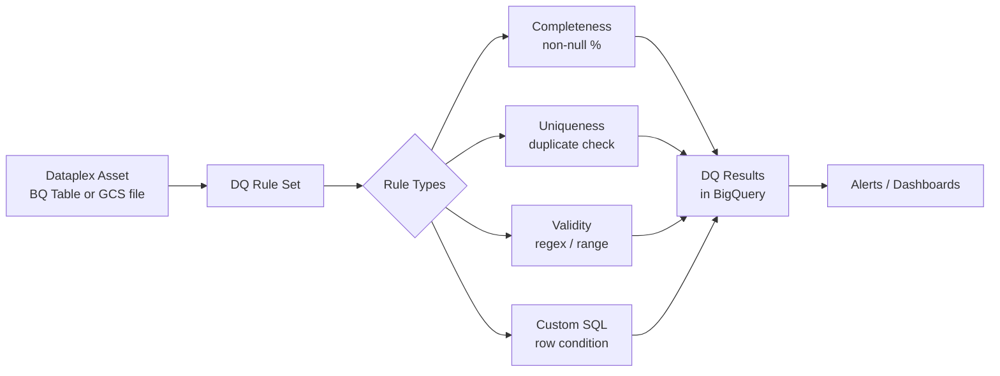

---

## Architecture Patterns

### Pattern 1: Modern ELT on BigQuery

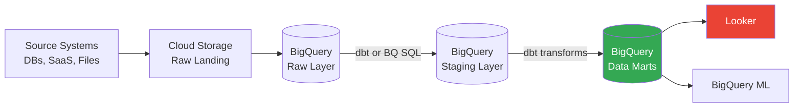

> The ELT pattern — load raw, transform inside BigQuery — is preferred over ETL on GCP because BigQuery compute is cheap and serverless. Minimize pre-processing outside BigQuery.

### Pattern 2: Hybrid Batch + Streaming (Kappa Architecture)

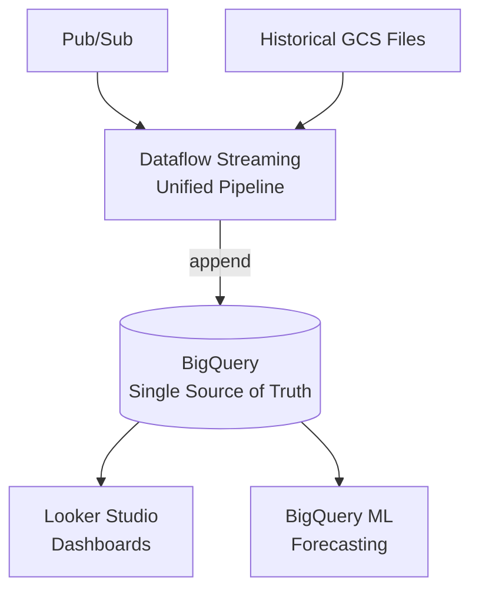

> Kappa simplifies Lambda by using **one streaming pipeline** for both real-time and historical data. Dataflow's unified batch+streaming model makes this natural.

### Pattern 3: Spark Migration Pattern (Dataproc)

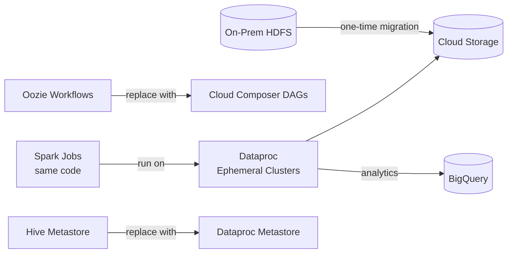

### Pattern 4: Governed Data Lake with Dataplex

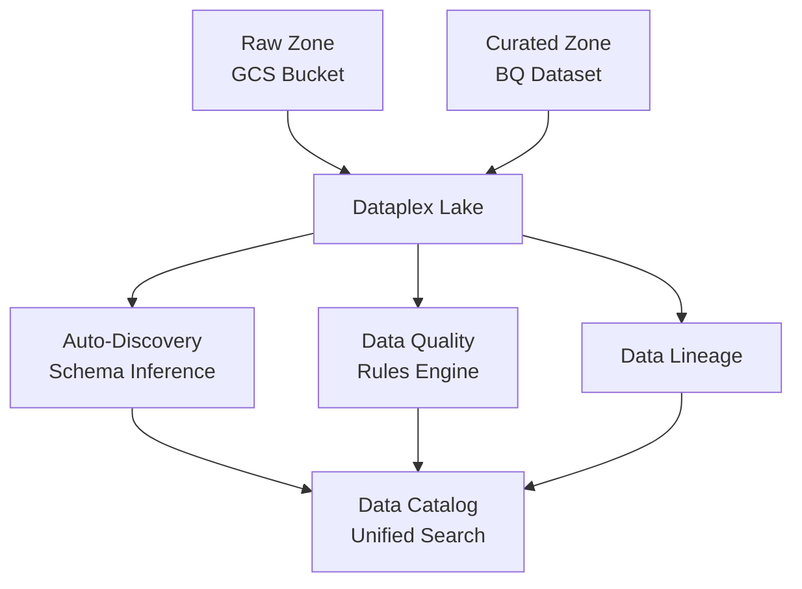

---

## Exam Deconstructions

### Question 1 — Dataflow vs Dataproc

**Scenario**: A retail company has 200 Apache Spark ETL jobs running on an on-premises Hadoop cluster. The jobs process nightly batch files from HDFS and write results to Hive tables. The team has deep Spark expertise but no experience with Apache Beam. The company wants to migrate to GCP with minimal code changes and cost.

**What is the recommended migration path?**
- A) Rewrite all 200 jobs in Apache Beam and run on Dataflow
- B) Migrate HDFS to GCS, run Spark jobs on ephemeral Dataproc clusters orchestrated by Cloud Composer
- C) Load all data into BigQuery and rewrite ETL as BigQuery SQL
- D) Run the existing Hadoop cluster on GCE VMs (lift-and-shift)

**Answer: B**

| Option | Analysis |
|--------|---------|
| **A** | Rewriting 200 jobs in Beam = massive effort, no Beam expertise, high risk |
| **B** ✅ | GCS replaces HDFS (path change only: `hdfs://` → `gs://`). Spark code runs unchanged on Dataproc. Ephemeral clusters cut idle cost. Composer replaces Oozie. Minimal code change, maximum GCP leverage |
| **C** | Rewriting 200 Spark jobs as BigQuery SQL is even more work than option A, and may not be possible for complex transformations |
| **D** | Self-managing Hadoop on GCE gives no GCP managed-service benefits; still pays for idle VMs |

---

### Question 2 — BigQuery ML vs Vertex AI

**Scenario**: A data analyst team (SQL-proficient, no Python/ML experience) needs to build a customer churn prediction model. The training data is already in BigQuery (10 million rows, 45 features). The model will be retrained weekly and predictions will feed directly back into BigQuery for downstream reporting. Time-to-production must be under 2 weeks.

**What is the best approach?**
- A) Use Vertex AI AutoML Tables — upload training data from BigQuery
- B) Use BigQuery ML with `LOGISTIC_REG` or `BOOSTED_TREE_CLASSIFIER`
- C) Use Dataproc + Spark MLlib to train the model, export to Cloud Storage
- D) Use Vertex AI custom training with a TensorFlow model

**Answer: B**

| Option | Analysis |
|--------|---------|
| **A** | AutoML Tables works, but requires exporting data from BQ, managing a Vertex AI endpoint, and importing predictions back — extra complexity the team doesn't need |
| **B** ✅ | BQML trains directly on BQ data (no export), SQL syntax the team already knows, predictions land in BQ via `ML.PREDICT()` (no import step), retraining is a scheduled query. 2-week timeline easily met |
| **C** | Spark MLlib requires Dataproc cluster management, PySpark/Scala code, model export — far beyond a SQL team's capability in 2 weeks |
| **D** | Custom TF training = Python, ML expertise, infrastructure setup — completely out of scope for a SQL analyst team |

---

### Question 3 — Streaming Deduplication

**Scenario**: A Dataflow streaming pipeline ingests Pub/Sub messages representing financial transactions. Due to network retries, the same transaction can be published multiple times. Each transaction has a unique `transaction_id`. The pipeline must guarantee that each transaction is processed **exactly once** before writing to BigQuery. The deduplication window is 24 hours.

**What is the correct approach?**
- A) Use fixed 24-hour windows and `GroupByKey` on `transaction_id`
- B) Enable exactly-once semantics between Pub/Sub and Dataflow using `MessageId` deduplication
- C) Use the Dataflow State API to maintain a `SetState` of seen `transaction_id` values per key, with a 24-hour timer to expire state
- D) Filter duplicates in BigQuery using `SELECT DISTINCT` after writing

**Answer: C**

| Option | Analysis |
|--------|---------|
| **A** | Fixed windows deduplicate *within* a window — a duplicate spanning two windows (e.g., T=23:59 and T=00:01) is missed |
| **B** | Pub/Sub + Dataflow exactly-once handles *delivery* deduplication but only within Pub/Sub's deduplication window (~10 minutes), not 24 hours |
| **C** ✅ | State API `SetState<transaction_id>` per key persists across window boundaries. A 24-hour processing-time timer clears expired state. Handles duplicates regardless of arrival timing within the 24h window |
| **D** | Writing duplicates to BigQuery and filtering post-hoc violates "exactly once **before** writing" — BigQuery will have duplicates until cleanup runs, which breaks downstream consumers |

---

## Module Cheat Sheet

```
┌────────────────────────────────────────────────────────────────────┐
│             PROCESSING & ANALYTICS — EXAM CHEAT SHEET              │
├──────────────────────────┬─────────────────────────────────────────┤
│ SERVICE                  │ KEY FACTS                               │
├──────────────────────────┼─────────────────────────────────────────┤
│ Dataflow                 │ Managed Beam; true streaming; serverless│
│ Dataflow Side Inputs     │ Small lookup joined into main stream    │
│ Dataflow State API       │ Per-key stateful; dedup across windows  │
│ Dataflow Shuffle Svc     │ Offloads GroupByKey off worker VMs      │
│ Dataflow Streaming Eng.  │ Offloads windowing state off worker VMs │
│ Flex Templates           │ Docker-based; dynamic params; preferred │
│ Dataproc                 │ Managed Spark/Hadoop; ephemeral=cheapest│
│ Dataproc Serverless      │ No cluster; batch Spark only            │
│ Dataproc Metastore       │ Managed Hive Metastore; shared catalog  │
│ Data Fusion              │ Visual ETL; runs on Dataproc; not cheap │
│ BigQuery ML              │ Train/predict in SQL; data stays in BQ  │
│ ARIMA_PLUS               │ Time series; auto-handles seasonality   │
│ ML.EXPLAIN_PREDICT()     │ SHAP values; model explainability       │
│ Looker                   │ LookML semantic layer; governed BI      │
│ Looker Studio            │ Free; ad-hoc; no semantic layer         │
│ Dataplex                 │ Data fabric; auto-discovery; DQ rules   │
├──────────────────────────┼─────────────────────────────────────────┤
│ DECISION RULES           │                                         │
│ Existing Spark code      │ → Dataproc (not Dataflow)               │
│ New streaming pipeline   │ → Dataflow (not Dataproc)               │
│ SQL team + BQ data       │ → BigQuery ML (not Vertex AI)           │
│ Visual ETL / Informatica │ → Data Fusion                           │
│ Governed BI, LookML      │ → Looker (not Looker Studio)            │
│ Data lake governance     │ → Dataplex (not just Data Catalog)      │
│ 24h stream dedup         │ → State API (not windowing)             │
├──────────────────────────┼─────────────────────────────────────────┤
│ GOTCHAS                  │                                         │
│ Dataproc Serverless      │ Batch only — no streaming               │
│ Data Fusion              │ Runs Dataproc under the hood (not free) │
│ Looker                   │ Does NOT store data — queries BQ live   │
│ ARIMA_PLUS               │ Auto seasonality — don't add manually   │
│ State API dedup          │ Not windowing — spans window boundaries  │
└──────────────────────────┴─────────────────────────────────────────┘
```

---

**Previous Module ←** [02 — Storage & Data Warehousing](../02-storage-warehousing/README.md)
**Next Module →** [04 — ML & MLOps](../04-ml-ops/README.md)
