# Module 04 — ML & MLOps

> **Exam weight: ~15%** | Services covered: Vertex AI (Training, Prediction, Pipelines, Feature Store, Model Registry, Experiments, Explainable AI, Model Monitoring), AutoML, Vertex AI Workbench

---

## Quick Navigation

- [The ML Decision Framework](#the-ml-decision-framework)
- [Vertex AI Platform Overview](#vertex-ai-platform-overview)
- [Training Options](#training-options)
- [Vertex AI Feature Store](#vertex-ai-feature-store)
- [Vertex AI Pipelines](#vertex-ai-pipelines)
- [Model Registry & Versioning](#model-registry--versioning)
- [Vertex AI Prediction](#vertex-ai-prediction)
- [Explainable AI](#explainable-ai)
- [Model Monitoring](#model-monitoring)
- [Vertex AI Experiments](#vertex-ai-experiments)
- [AutoML](#automl)
- [Neural Network Optimization](#neural-network-optimization)
- [Architecture Patterns](#architecture-patterns)
- [Exam Deconstructions](#exam-deconstructions)
- [Module Cheat Sheet](#module-cheat-sheet)

---

## The ML Decision Framework

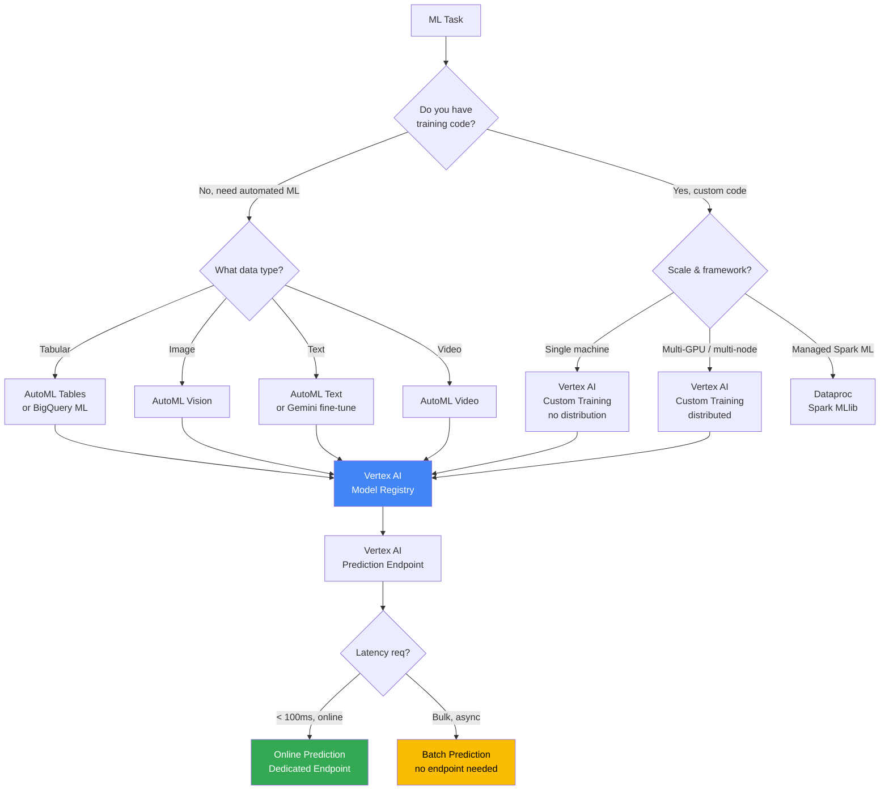

---

## Vertex AI Platform Overview

Vertex AI is GCP's **unified ML platform** — one place for every stage of the ML lifecycle.

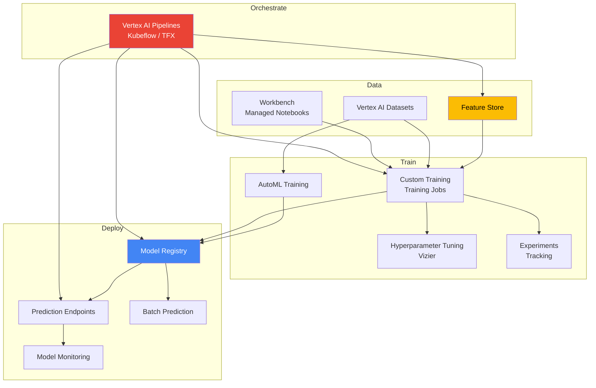

---

## Training Options

### Custom Training — Container Options

| Option | When to Use |
|--------|-------------|
| **Pre-built containers** | Standard frameworks (TF, PyTorch, scikit-learn, XGBoost) — fastest path |
| **Custom containers** | Non-standard dependencies, custom frameworks, specific OS packages |
| **Training pipelines** | Orchestrated multi-step training (data prep → train → eval → deploy) |

### Distributed Training Strategies

| Strategy | Framework | Description | Best For |
|----------|-----------|-------------|---------|
| **MirroredStrategy** | TensorFlow | Synchronous, multi-GPU, single machine | Large model, 1 machine |
| **MultiWorkerMirroredStrategy** | TensorFlow | Synchronous, multi-GPU, multi-machine | Very large models |
| **ParameterServerStrategy** | TensorFlow | Async, parameter server pattern | Sparse embeddings |
| **DataParallel** | PyTorch DDP | Synchronous, multi-GPU | PyTorch standard |
| **ModelParallel** | PyTorch FSDP | Split model across GPUs | Models too large for 1 GPU |

> **Exam trap**: The exam often shows scenarios with a model that won't fit on a single GPU. The answer is **model parallelism** (not data parallelism). Data parallelism requires the full model to fit on each GPU — it only splits the data.

### Hyperparameter Tuning — Vertex AI Vizier

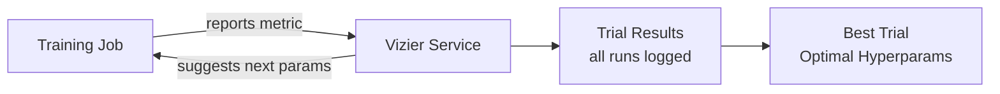

- Vizier uses **Bayesian optimization** by default (not grid search)
- Supports `maximize` or `minimize` on any metric (e.g., val_accuracy, RMSE)
- **Early stopping**: Kills underperforming trials to save compute
- Define search space with: `DoubleParameterSpec`, `IntegerParameterSpec`, `CategoricalParameterSpec`, `DiscreteParameterSpec`

> **Pro-tip**: Bayesian optimization is more sample-efficient than grid search — it learns from prior trials. The exam may ask why Vizier finds better results with fewer trials than manual grid search.

### Compute Options

| Accelerator | Use Case |
|-------------|---------|
| CPU | Tabular models, scikit-learn, XGBoost |
| **GPU (T4, A100, H100)** | Deep learning, large embeddings |
| **TPU v4/v5** | Very large TF models (LLMs, vision transformers) |
| GPU (A100 80GB) | Models that don't fit on standard GPU (VRAM limit) |

---

## Vertex AI Feature Store

### What It Is

Feature Store is a **centralized repository for ML features** — it solves the training-serving skew problem by ensuring the same feature computation logic is used in both training and online serving.

### The Training-Serving Skew Problem

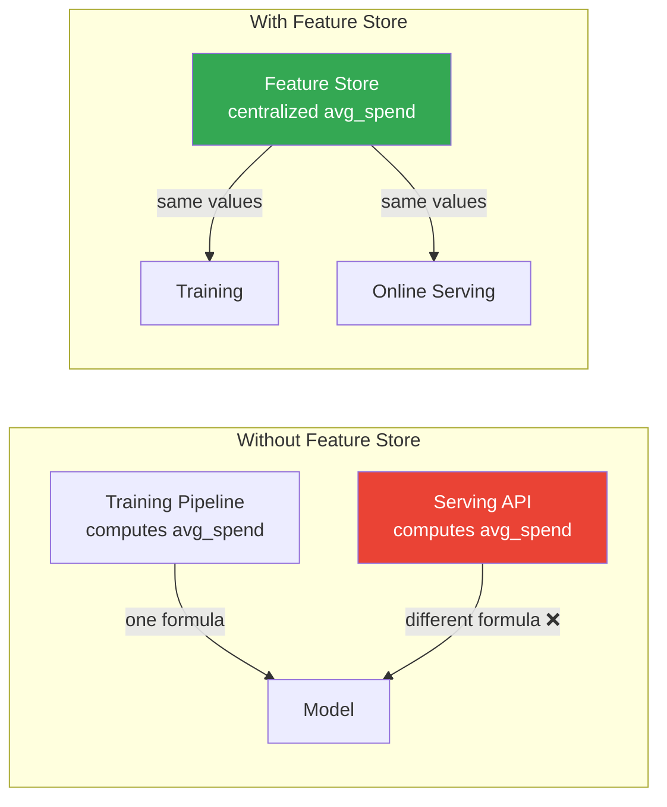

### Feature Store Architecture (Gen 2 — Bigtable backend)

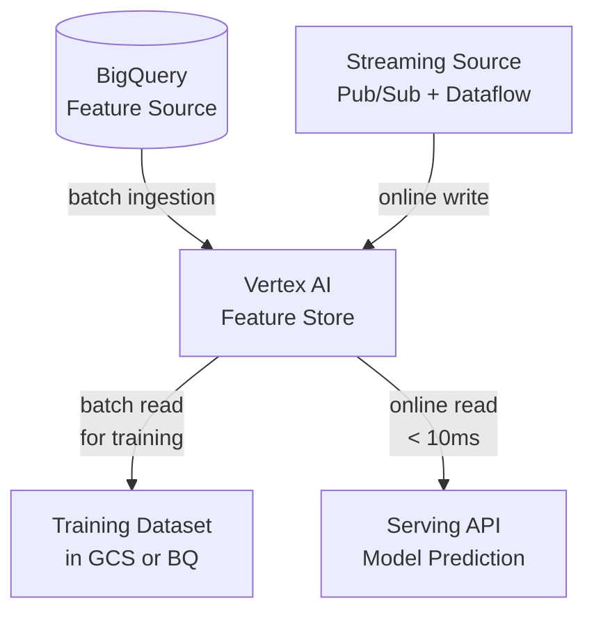

### Key Concepts

| Concept | Definition |
|---------|-----------|
| **Feature Group** | Logical grouping of related features (e.g., `user_features`) |
| **Feature** | Individual attribute (e.g., `30d_avg_spend`) |
| **Feature View** | A query over Feature Groups, defining what the model sees |
| **Entity** | The object features describe (user_id, product_id) |
| **Point-in-time lookup** | Retrieve feature values as they existed at a specific past timestamp — prevents data leakage |

> **Exam trap — Data Leakage**: When building a training dataset from a Feature Store, always use **point-in-time correct** lookups. If you accidentally use a feature value that was computed *after* the label's timestamp, the model learns from the future → inflated training metrics, poor production performance.

### When to Use Feature Store

| ✅ Good Fit | ❌ Poor Fit |
|-----------|-----------|
| Features shared across multiple models | Single model, no reuse |
| Training-serving skew is a concern | Batch-only prediction (no online serving) |
| Online serving needs < 10ms feature lookup | All features computable at prediction time |
| Feature reuse and governance matter | Simple feature engineering in SQL |

---

## Vertex AI Pipelines

### What It Is

Vertex AI Pipelines is a **managed ML pipeline orchestrator** supporting **KFP (Kubeflow Pipelines)** and **TFX (TensorFlow Extended)** DSLs.

### KFP Pipeline Anatomy

```python
from kfp import dsl

@dsl.component(base_image='python:3.10')
def train_model(training_data: str, model_output: dsl.Output[dsl.Model]):
    # training logic here
    ...

@dsl.component
def evaluate_model(model: dsl.Input[dsl.Model]) -> float:
    ...

@dsl.pipeline(name='churn-prediction-pipeline')
def churn_pipeline(data_path: str):
    train_task = train_model(training_data=data_path)
    eval_task = evaluate_model(model=train_task.outputs['model_output'])
```

### Vertex AI Pipelines vs Cloud Composer

| | Vertex AI Pipelines | Cloud Composer |
|--|--------------------|-----------:---|
| Purpose | ML workflows (train → eval → deploy) | General data/ETL orchestration |
| DSL | KFP / TFX (Python decorators) | Airflow DAGs (Python) |
| Artifact tracking | Built-in (ML Metadata) | None natively |
| Caching | Step-level caching built-in | Not built-in |
| Scaling | Serverless, per-step containers | GKE workers |
| Best for | MLOps pipelines | ETL, cross-service workflows |

> **Exam rule**: ML training pipeline → Vertex AI Pipelines. Data engineering orchestration → Cloud Composer. The two complement each other: Composer can trigger Vertex AI Pipelines as a step.

### Pipeline Caching

- Each pipeline component is cached by its **inputs + code hash**
- Rerunning a pipeline skips unchanged upstream steps → saves cost and time
- Disable with `enable_caching=False` for components requiring fresh execution (e.g., data ingestion)

---

## Model Registry & Versioning

### Model Lifecycle in Vertex AI

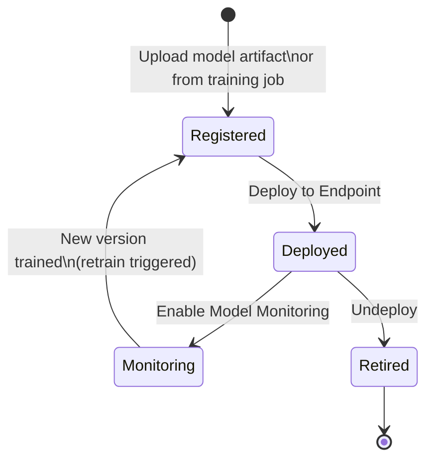

### Model Versioning

- Each model in the registry can have **multiple versions**
- Each version has its own artifact URI (GCS path), metadata, and evaluation metrics
- **Traffic splitting**: Split prediction traffic across versions (e.g., 90% v1, 10% v2) for A/B testing

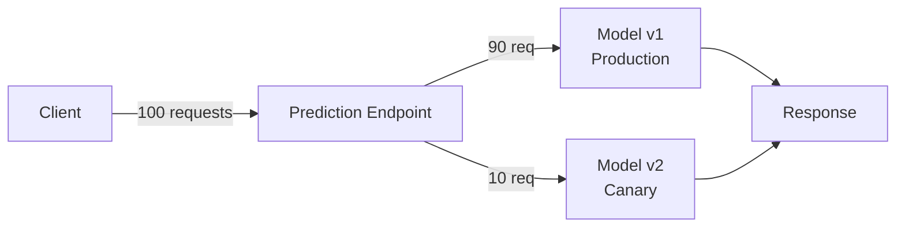

> **Exam trap**: Traffic splitting for A/B testing in Vertex AI happens at the **Endpoint** level, not the Model Registry level. You deploy multiple model versions to the same endpoint with split percentages.

---

## Vertex AI Prediction

### Online vs Batch Prediction

| | Online Prediction | Batch Prediction |
|--|-----------------|-----------------|
| Endpoint required | ✅ Yes (dedicated or shared) | ❌ No endpoint |
| Latency | Milliseconds | Minutes to hours |
| Input | Single instance or small batch | Millions of rows from GCS/BQ |
| Billing | Per compute-hour (node uptime) | Per compute-hour (job duration) |
| Scaling | Auto-scales (min/max nodes) | Auto-scales per job |
| Use case | Real-time API calls | Nightly scoring, bulk inference |

### Dedicated vs Shared Endpoints

| | Dedicated Endpoint | Shared Endpoint |
|--|-------------------|----------------|
| Isolation | Full VM isolation | Shared infrastructure |
| Cold start | None (always warm) | Possible |
| Cost | Higher (always running) | Lower |
| Use case | Production, SLA-bound | Dev/test, low traffic |

> **Pro-tip**: For production endpoints serving > 100 QPS with SLA requirements, always use **Dedicated Endpoints** with **min replicas ≥ 1** to avoid cold starts.

---

## Explainable AI

### Why It Matters on the Exam

The exam tests understanding of *when* and *how* to explain model predictions — a requirement in regulated industries (finance, healthcare).

### Attribution Methods

| Method | How It Works | Works With |
|--------|-------------|-----------|
| **Sampled Shapley** | Approximates SHAP values by sampling feature permutations | Tabular (all model types) |
| **Integrated Gradients** | Integrates gradients from baseline to input | Neural networks (TF/PyTorch) |
| **XRAI** | Region-based attribution for images | Image models |
| **LIME** | Local linear approximation around a prediction | Any model (black-box) |

### Configuring Explainability

```python
explanation_metadata = ExplanationMetadata(
    inputs={
        "feature_1": ExplanationMetadata.InputMetadata(),
        "feature_2": ExplanationMetadata.InputMetadata(),
    },
    outputs={"prediction": ExplanationMetadata.OutputMetadata()}
)

explanation_parameters = ExplanationParameters(
    sampled_shapley_attribution=SampledShapleyAttribution(path_count=25)
)
```

> **Exam rule**: Tabular model + need feature importance per prediction → **Sampled Shapley**. Neural network image classification + need pixel-level explanation → **XRAI** or **Integrated Gradients**. Compare: BigQuery ML uses `ML.EXPLAIN_PREDICT()` (also SHAP-based); Vertex AI uses Explainable AI with the same underlying concept.

---

## Model Monitoring

### What It Detects

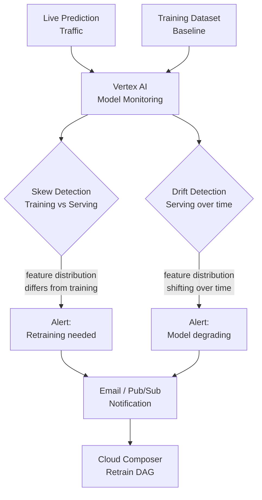

### Skew vs Drift

| | Training-Serving Skew | Prediction Drift |
|--|----------------------|-----------------|
| What it compares | Training data vs live serving data | Live serving data vs itself over time |
| Root cause | Pipeline bug, feature store inconsistency | Real-world data distribution shift |
| Detection metric | Jensen-Shannon divergence (categorical), L-infinity (numerical) |Same |
| Action | Fix feature pipeline, retrain | Retrain on recent data |

> **Exam trap**: Skew is a **pipeline correctness** problem (your serving features differ from training). Drift is a **world change** problem (the real world changed). Both trigger retraining, but the fix is different.

### Configuring Alert Thresholds

- **Skew threshold**: How much divergence between training and serving is tolerable (e.g., 0.3 for L-infinity)
- **Drift threshold**: How much serving distribution can shift before alerting
- **Sampling rate**: Not all predictions are logged (cost control) — configure sampling % per endpoint

---

## Vertex AI Experiments

### Experiment Tracking

Track and compare training runs across:
- **Parameters**: Learning rate, batch size, optimizer
- **Metrics**: Accuracy, F1, RMSE per epoch
- **Artifacts**: Model checkpoints, datasets used

```python
from google.cloud import aiplatform

aiplatform.init(experiment='churn-model-v2')

with aiplatform.start_run('run-lr-0.01-batch-256'):
    aiplatform.log_params({'lr': 0.01, 'batch_size': 256})
    # ... training loop ...
    aiplatform.log_metrics({'accuracy': 0.912, 'auc': 0.97})
```

> **Vertex AI Experiments vs TensorBoard**: Both visualize training metrics. Experiments integrates natively with Vertex AI jobs and stores metadata in ML Metadata. TensorBoard is a local/custom tool — Vertex AI has a managed TensorBoard service too, which can be linked to Experiments.

---

## AutoML

### AutoML Capabilities by Data Type

| Data Type | Task | AutoML Product |
|-----------|------|----------------|
| **Tabular** | Classification, Regression, Forecasting | AutoML Tables / Vertex AI |
| **Image** | Classification, Object Detection, Segmentation | AutoML Vision |
| **Text** | Classification, Entity Extraction, Sentiment | AutoML Natural Language |
| **Video** | Classification, Object Tracking, Action Recognition | AutoML Video |

### AutoML vs Custom Training

| | AutoML | Custom Training |
|--|--------|----------------|
| Code required | None | Yes (Python/TF/PyTorch) |
| Control | Low (black box) | Full |
| Time to first model | Hours | Days to weeks |
| Production accuracy | Good (often competitive) | Best (tuned for your use case) |
| Explainability | Built-in (feature importance) | Manual configuration |
| Cost | Higher per-hour | Lower if optimized |

> **Exam rule**: If the scenario says "no ML expertise," "fastest time to model," or "business analyst team" → AutoML. If it says "custom architecture," "specific neural network topology," or "research team" → Custom Training.

---

## Neural Network Optimization

> This is a focused exam topic: optimizing deep learning model topology and training.

### Regularization Techniques

| Technique | How It Works | When to Use |
|-----------|-------------|-------------|
| **Dropout** | Randomly zeros neuron outputs during training (rate: 0.2–0.5) | Overfitting on dense layers |
| **L1 Regularization (Lasso)** | Adds sum of absolute weights to loss | Sparse features, feature selection |
| **L2 Regularization (Ridge)** | Adds sum of squared weights to loss | General overfitting prevention |
| **Batch Normalization** | Normalizes layer inputs across a mini-batch | Deep networks, training instability |
| **Early Stopping** | Halts training when val loss stops improving | Any network; free regularization |
| **Data Augmentation** | Artificially expands training set (flip, crop, rotate) | Image models, small datasets |

> **Exam focus — Dropout**: The exam specifically tests dropout. Key facts:
> - Applied only during **training**, not inference
> - Rate of **0.5** (50%) is common for fully connected layers
> - Applied **after** activation functions
> - Prevents co-adaptation of neurons → reduces overfitting
> - PyTorch: `nn.Dropout(p=0.5)` | TF/Keras: `layers.Dropout(0.5)`

### Optimizer Comparison

| Optimizer | Behavior | Best For |
|-----------|---------|---------|
| **SGD** | Fixed learning rate, noisy | Simple models, large datasets |
| **SGD + Momentum** | Dampens oscillations | Better convergence than plain SGD |
| **Adam** | Adaptive learning rates per parameter | Most deep learning tasks (default choice) |
| **AdaGrad** | Decays LR for frequent features | Sparse features, NLP |
| **RMSprop** | Adaptive LR, good for RNNs | Recurrent networks |

### Learning Rate Strategies

```
Constant LR      → Simple, but hard to tune
LR Decay         → Reduce LR over epochs (step, exponential)
Cosine Annealing → Cyclical LR with cosine curve
Warmup + Decay   → Start low, ramp up, then decay (LLM standard)
```

### Activation Functions — Exam Reference

| Function | Formula | Use Case |
|----------|---------|---------|
| **ReLU** | max(0, x) | Hidden layers (default) |
| **Sigmoid** | 1/(1+e^-x) | Binary output layer |
| **Softmax** | e^x / Σe^x | Multi-class output layer |
| **Tanh** | (e^x - e^-x)/(e^x + e^-x) | RNNs, hidden layers |
| **Leaky ReLU** | max(0.01x, x) | Dying ReLU fix |
| **GELU** | x·Φ(x) | Transformers, BERT, GPT |

> **Dying ReLU problem**: If a neuron's input is always negative, ReLU always outputs 0 — the neuron never learns. Fix: **Leaky ReLU**, **ELU**, or **careful weight initialization** (He initialization for ReLU layers).

---

## Architecture Patterns

### Pattern 1: End-to-End MLOps Pipeline

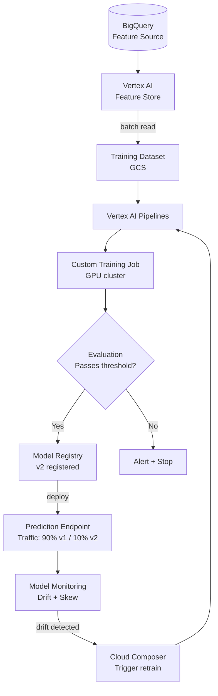

### Pattern 2: Feature Store for Real-Time Personalization

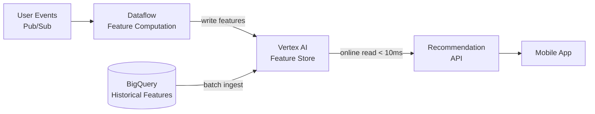

### Pattern 3: Batch Scoring Pipeline

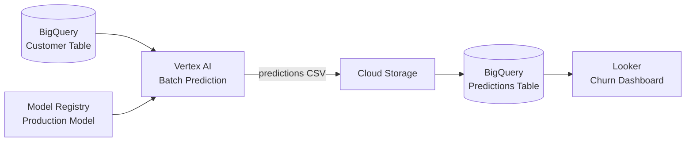

---

## Exam Deconstructions

### Question 1 — Dropout for Overfitting

**Scenario**: A data scientist trains a 5-layer neural network classifier on a 50,000-row tabular dataset. The model achieves 97% training accuracy but only 71% validation accuracy. The validation loss increases after epoch 10 while training loss continues to decrease. The team wants to fix overfitting without collecting more data.

**What is the most effective first intervention?**
- A) Increase the number of neurons in each hidden layer
- B) Add Dropout layers (rate=0.3–0.5) after each dense layer and apply L2 regularization
- C) Switch from Adam to SGD optimizer
- D) Increase the batch size to reduce gradient noise

**Answer: B**

| Option | Analysis |
|--------|---------|
| **A** | More neurons = more model capacity = more overfitting. This makes the problem worse |
| **B** ✅ | Dropout randomly disables neurons during training, preventing co-adaptation. L2 adds weight penalty. Both directly address overfitting. The classic dual intervention for this symptom |
| **C** | Optimizer choice affects convergence speed, not overfitting. SGD may even overfit more with enough epochs |
| **D** | Larger batches reduce gradient noise (less regularization effect) and can actually increase overfitting |

---

### Question 2 — Training-Serving Skew

**Scenario**: A production recommendation model shows declining CTR after 3 months, despite no changes to the model or serving code. Vertex AI Model Monitoring alerts show that the `user_30d_purchase_count` feature's distribution in serving traffic has shifted significantly from its training distribution. The team suspects a data pipeline issue.

**What are the two most likely root causes?** (select two)
- A) The model is overfitting to the training data
- B) The feature computation logic in the serving pipeline was updated without retraining
- C) Real-world user behavior has changed over time (concept drift)
- D) The prediction endpoint has insufficient replicas
- E) The training dataset used future data (data leakage)

**Answer: B and C**

| Option | Analysis |
|--------|---------|
| **A** | Overfitting would show during initial evaluation, not degrade after 3 months |
| **B** ✅ | If serving feature logic changed without retraining, the model sees a different feature distribution than it was trained on — **training-serving skew** |
| **C** ✅ | User behavior naturally shifts (new products, seasonal patterns, economic changes) — **concept drift** — causing serving distribution to diverge from the static training distribution |
| **D** | Insufficient replicas causes latency, not feature distribution drift |
| **E** | Data leakage inflates training metrics initially — it doesn't cause gradual degradation after 3 months |

---

### Question 3 — Vertex AI Pipelines vs Composer

**Scenario**: A team needs to orchestrate the following weekly workflow: (1) export feature data from BigQuery to GCS, (2) train a Vertex AI custom model, (3) evaluate the model against a held-out test set, (4) if accuracy > 0.90 deploy to the production endpoint, (5) notify the team via email. The workflow must track model artifacts, parameters, and metrics for reproducibility.

**Which orchestration tool is most appropriate?**
- A) Cloud Composer with Airflow DAG calling each step via operators
- B) Vertex AI Pipelines with KFP components, triggered by Cloud Scheduler
- C) Cloud Workflows calling each GCP API sequentially
- D) Dataflow with a custom pipeline connecting all steps

**Answer: B**

| Option | Analysis |
|--------|---------|
| **A** | Composer can technically do this, but has no built-in ML artifact tracking, no component caching, and is heavier than needed for a pure ML pipeline |
| **B** ✅ | KFP components for each step: conditional logic (`dsl.Condition` for accuracy gate), built-in artifact tracking via ML Metadata, step caching, Cloud Scheduler for weekly trigger. Designed exactly for this use case |
| **C** | Cloud Workflows has no ML artifact tracking; each step is a raw API call with no caching or lineage |
| **D** | Dataflow is a data processing engine, not a workflow orchestrator — wrong tool entirely |

---

## Module Cheat Sheet

```
┌─────────────────────────────────────────────────────────────────────┐
│                  ML & MLOPS — EXAM CHEAT SHEET                      │
├──────────────────────────┬──────────────────────────────────────────┤
│ COMPONENT                │ KEY FACTS                                │
├──────────────────────────┼──────────────────────────────────────────┤
│ AutoML                   │ No code; fastest; good accuracy          │
│ Custom Training          │ Full control; GPU/TPU; any framework     │
│ Vertex AI Vizier         │ Bayesian HPT; early stopping             │
│ Feature Store            │ Prevents train-serve skew; < 10ms online │
│ Point-in-time lookup     │ Prevents data leakage in training sets   │
│ Vertex AI Pipelines      │ KFP/TFX; artifact tracking; caching      │
│ Model Registry           │ Versioning; traffic split for A/B        │
│ Online Prediction        │ Endpoint required; ms latency            │
│ Batch Prediction         │ No endpoint; GCS/BQ input; bulk scoring  │
│ Explainable AI           │ Tabular → Shapley; Image → XRAI/IntGrad  │
│ Model Monitoring         │ Skew = pipeline bug; Drift = world change│
│ Dropout                  │ Training only; 0.5 rate; anti-overfitting│
│ Model Parallelism        │ Model too big for 1 GPU → split it       │
│ Data Parallelism         │ Full model per GPU; split data           │
├──────────────────────────┼──────────────────────────────────────────┤
│ DECISION RULES           │                                          │
│ No ML expertise          │ → AutoML (not Custom Training)           │
│ Existing Spark MLlib     │ → Dataproc (not Vertex AI)               │
│ Real-time feature lookup │ → Feature Store (not BQ at serve time)   │
│ ML pipeline orchestration│ → Vertex AI Pipelines (not Composer)     │
│ A/B model testing        │ → Traffic split on Endpoint              │
│ Bulk nightly scoring     │ → Batch Prediction (no endpoint)         │
│ Overfitting on dense NN  │ → Dropout + L2 (not more neurons)        │
│ Model degrading slowly   │ → Check drift + skew in monitoring       │
├──────────────────────────┼──────────────────────────────────────────┤
│ GOTCHAS                  │                                          │
│ Dropout                  │ OFF at inference time — training only    │
│ Model parallelism        │ Not the same as data parallelism         │
│ Traffic split            │ On Endpoint, not Model Registry          │
│ Feature Store point-in-t.│ Skip this → data leakage → bad model    │
│ Skew vs Drift            │ Skew = your bug; Drift = world changed   │
│ AutoML cost              │ More expensive per hour than custom      │
└──────────────────────────┴──────────────────────────────────────────┘
```

---

**Previous Module ←** [03 — Processing & Analytics](../03-processing-analytics/README.md)
**Next Module →** [05 — Security & Compliance](../05-security-compliance/README.md)
