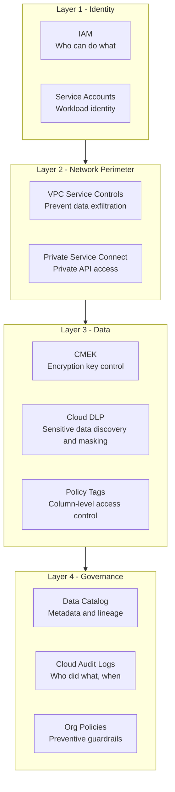
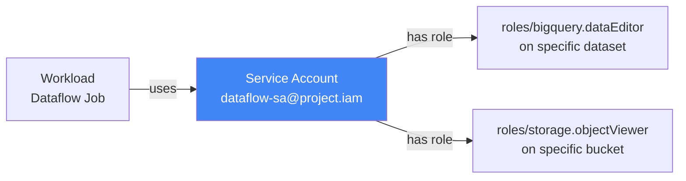
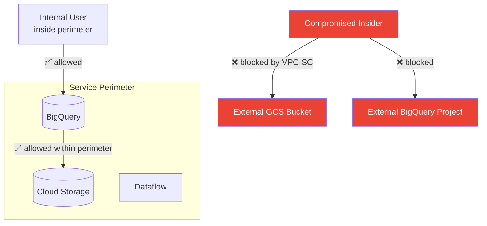
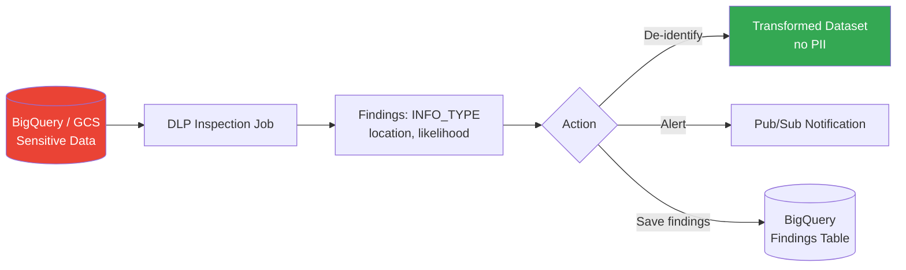
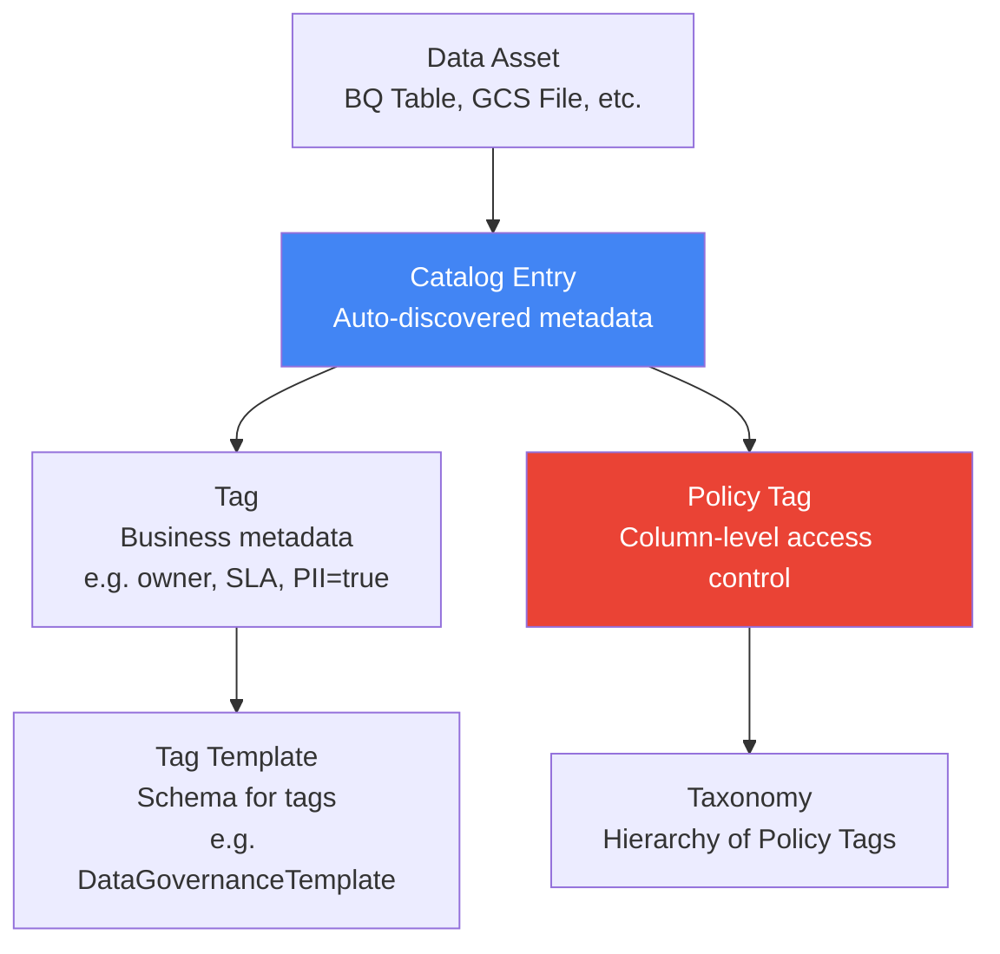
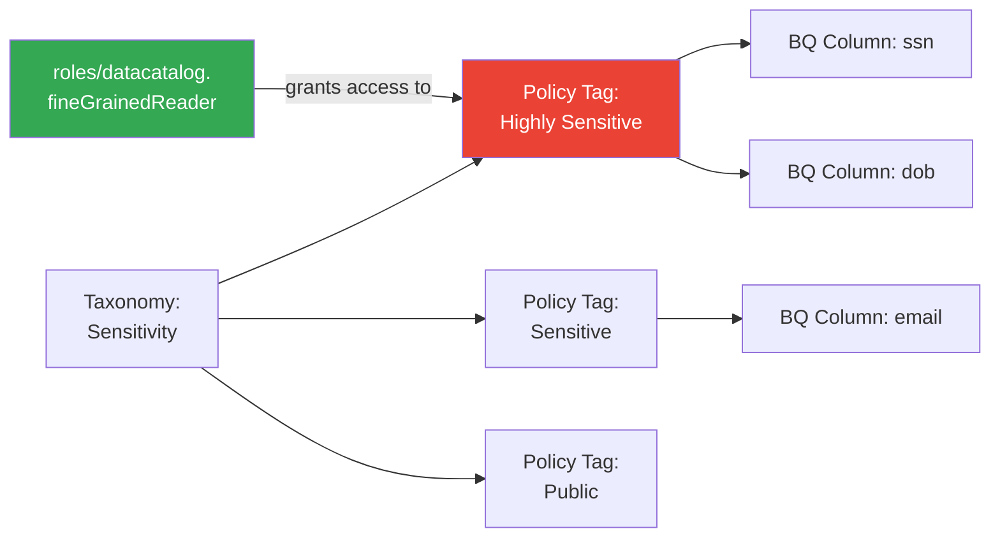
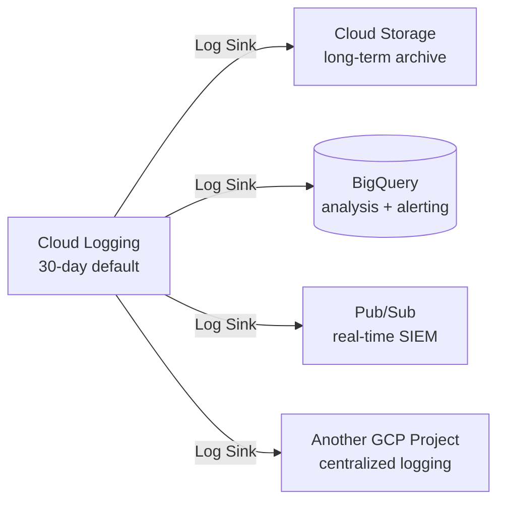
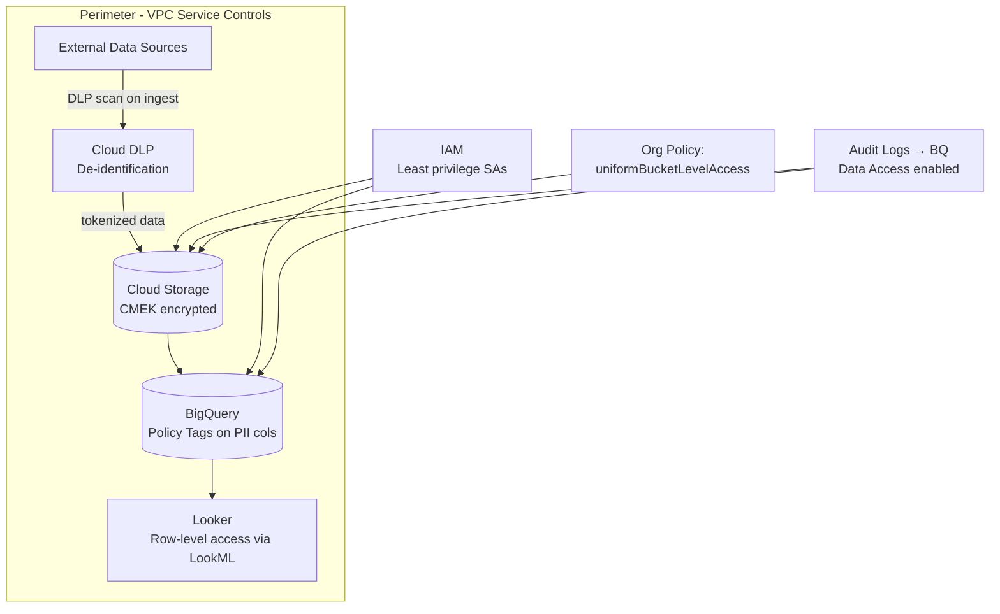
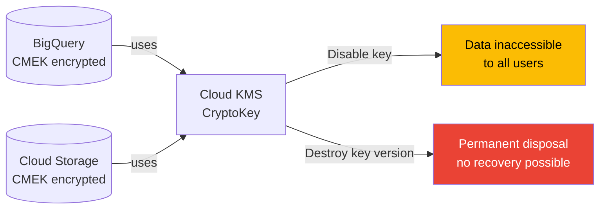
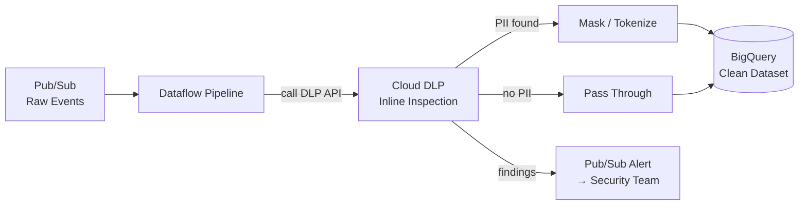

# Module 05 — Security & Compliance

> **Exam weight: ~18%** | Services covered: IAM, VPC Service Controls, CMEK/CSEK, Cloud DLP, Data Catalog, Cloud Audit Logs, Secret Manager, Organizational Policies

---

## Quick Navigation

- [Security Layers Framework](#security-layers-framework)
- [IAM — Identity & Access Management](#iam--identity--access-management)
- [VPC Service Controls](#vpc-service-controls)
- [Encryption: CMEK, CSEK, GMEK](#encryption-cmek-csek-gmek)
- [Cloud DLP — Data Loss Prevention](#cloud-dlp--data-loss-prevention)
- [Data Catalog](#data-catalog)
- [Cloud Audit Logs](#cloud-audit-logs)
- [Secret Manager](#secret-manager)
- [Organizational Policies](#organizational-policies)
- [Per-Service Security Reference](#per-service-security-reference)
- [Architecture Patterns](#architecture-patterns)
- [Exam Deconstructions](#exam-deconstructions)
- [Module Cheat Sheet](#module-cheat-sheet)

---

## Security Layers Framework

GCP data security is **defense in depth** — multiple independent layers. The exam tests whether you know which layer solves which problem.



> **Exam principle**: No single layer is sufficient. A question asking "how do you prevent an insider from exfiltrating BigQuery data to a personal GCS bucket?" needs **both** IAM (restrict BQ permissions) **and** VPC-SC (block API calls to external GCS).

---

## IAM — Identity & Access Management

### Resource Hierarchy & Policy Inheritance

```
Organization
└── Folder
    └── Project
        └── Resource (BQ Dataset, GCS Bucket, etc.)

IAM policies are ADDITIVE down the hierarchy.
A DENY policy at Org level blocks access even if Project grants it.
```

> **Exam trap**: IAM policies at a **lower level cannot restrict** what a higher level grants — they can only add permissions. To restrict, use **IAM Deny policies** (not just removing roles from a lower level). Deny policies are evaluated before Allow policies.

### Principal Types

| Principal | Description | Best Practice |
|-----------|-------------|---------------|
| `user:` | Google Account | Avoid for automated workloads |
| `group:` | Google Group | Preferred for humans (manage via group) |
| `serviceAccount:` | SA for workloads | Use for all GCP services |
| `domain:` | Google Workspace domain | Grant to entire org domain |
| `allUsers` | Public internet | GCS public buckets only |
| `allAuthenticatedUsers` | Any Google account | Avoid — not restricted to your org |

### Predefined Roles — Data Engineering Quick Reference

| Service | Role | Permissions |
|---------|------|-------------|
| BigQuery | `roles/bigquery.dataViewer` | Read tables/views |
| BigQuery | `roles/bigquery.dataEditor` | Read + write tables |
| BigQuery | `roles/bigquery.jobUser` | Run jobs (required with dataViewer to query) |
| BigQuery | `roles/bigquery.admin` | Full control |
| GCS | `roles/storage.objectViewer` | Read objects |
| GCS | `roles/storage.objectCreator` | Create (not read/delete) |
| GCS | `roles/storage.objectAdmin` | Full object control |
| Pub/Sub | `roles/pubsub.publisher` | Publish messages |
| Pub/Sub | `roles/pubsub.subscriber` | Create/consume subscriptions |
| Dataflow | `roles/dataflow.developer` | Submit and manage jobs |
| Bigtable | `roles/bigtable.reader` | Read rows |
| Bigtable | `roles/bigtable.user` | Read + write rows |
| Spanner | `roles/spanner.databaseReader` | Execute SQL reads |
| Vertex AI | `roles/aiplatform.user` | Submit training, prediction jobs |

> **Exam trap — BigQuery query access**: A user with only `bigquery.dataViewer` CANNOT run queries — they can only read table metadata. They also need `bigquery.jobUser` on the **project** to submit query jobs. This two-role requirement is a classic exam gotcha.

### Service Account Best Practices



- **Least privilege**: Grant the minimum role on the most specific resource
- **Workload Identity Federation**: Allow non-GCP workloads (AWS, GitHub Actions, on-prem) to impersonate a service account without a key file
- **Service Account impersonation**: One SA can impersonate another — useful for CI/CD pipelines
- **Key rotation**: Avoid SA key files when possible; if required, rotate every 90 days

---

## VPC Service Controls

### What It Solves

VPC-SC creates a **security perimeter** around GCP services, preventing data from being moved outside the perimeter — even by users with valid IAM permissions.



### Key Concepts

| Concept | Description |
|---------|-------------|
| **Service Perimeter** | Logical boundary around a set of GCP projects and services |
| **Access Level** | Conditions that grant access from outside (IP range, device policy, identity) |
| **Ingress Rule** | Allow specific external → internal API calls |
| **Egress Rule** | Allow specific internal → external API calls |
| **Dry-run mode** | Log violations without enforcing — use for testing before enforcement |

### VPC-SC vs IAM

| | IAM | VPC-SC |
|--|-----|--------|
| Controls | Who can do what | Where data can flow |
| Scope | Per-resource | Per-perimeter (multi-project) |
| Prevents exfiltration | ❌ (IAM can't stop a `gsutil cp` to personal bucket) | ✅ (blocks the API call at the network level) |
| Granularity | Action-level | Service + project level |
| Use together | ✅ Always | ✅ Always |

> **Exam trap**: VPC-SC is not an alternative to IAM — it's an **additional layer**. Use both. VPC-SC alone doesn't define who can access a resource; IAM alone can't stop data exfiltration by a legitimate user.

### Uniform Bucket-Level Access (UBAC) Requirement

VPC Service Controls **requires** UBAC on all GCS buckets within the perimeter. Per-object ACLs bypass VPC-SC — UBAC disables them, ensuring all access goes through IAM (which VPC-SC can then intercept).

---

## Encryption: CMEK, CSEK, GMEK

### Encryption Hierarchy

```
GMEK (Google-Managed Encryption Keys)  ← Default, no config needed
  └── Key managed entirely by Google
  └── Rotated automatically

CMEK (Customer-Managed Encryption Keys) ← You control the key in Cloud KMS
  └── Key stored in Cloud KMS (your project)
  └── You control rotation and revocation
  └── Audit log every time key is used
  └── Revoking key → data becomes inaccessible

CSEK (Customer-Supplied Encryption Keys) ← You provide the key per request
  └── Key never stored by Google
  └── You supply key with every API call
  └── Google discards key after use
  └── Highest control, highest operational burden
```

### CMEK — When the Exam Requires It

| Scenario Signal | Answer |
|----------------|--------|
| "Compliance requires key rotation audit trail" | CMEK |
| "Revoke access to data by disabling a key" | CMEK |
| "Regulatory requires you to control encryption keys" | CMEK |
| "Data must be unreadable if Google is compromised" | CSEK (not CMEK — Google still holds CMEK keys) |
| "No key management overhead" | GMEK (default) |

> **Exam trap — CMEK does NOT prevent Google from reading data**: With CMEK, Google's systems still handle decryption — your key is in Cloud KMS which Google manages. If you need protection *from Google*, you need CSEK (you supply the key, Google never stores it).

### CMEK Services Support

BigQuery, Cloud Storage, Bigtable, Spanner, Pub/Sub, Dataflow, Vertex AI, Cloud SQL, Compute Engine — all support CMEK. Not all services support CSEK.

### Cloud KMS Key Hierarchy

```
Key Ring (region-bound)
└── CryptoKey
    └── CryptoKey Version (the actual key material)
        ├── Primary version (used for encryption)
        └── Enabled/Disabled/Destroyed versions
```

> **Key rotation**: Rotating a key creates a new version; old versions remain to decrypt existing data. **Destroying** a version permanently destroys the key material — all data encrypted with it becomes unrecoverable.

---

## Cloud DLP — Data Loss Prevention

### What It Does

DLP discovers, classifies, and de-identifies sensitive data (PII, PHI, PCI) across GCS, BigQuery, and Datastore — and can transform it before it reaches downstream systems.

### Core Workflow



### InfoTypes — Exam Reference

| InfoType | Detects |
|----------|---------|
| `PERSON_NAME` | First/last names |
| `EMAIL_ADDRESS` | Email addresses |
| `PHONE_NUMBER` | Phone numbers |
| `US_SOCIAL_SECURITY_NUMBER` | US SSNs |
| `CREDIT_CARD_NUMBER` | Credit card numbers |
| `IP_ADDRESS` | IPv4/IPv6 addresses |
| `DATE_OF_BIRTH` | Birth dates |
| `IBAN_CODE` | Bank account numbers |
| Custom regex/dictionary | Your own patterns |

### De-identification Transformations

| Transformation | Description | Reversible? | Use Case |
|---------------|-------------|-------------|---------|
| **Redaction** | Replace with `[REDACTED]` | ❌ No | Logging, low-sensitivity output |
| **Masking** | Replace chars with `*` (e.g., `***-**-1234`) | ❌ No | Partial display (last 4 digits) |
| **Tokenization** | Replace with random token | ✅ Yes (with key) | Analytics that need re-identification |
| **Format-preserving encryption (FPE)** | Encrypt while keeping format (SSN → SSN-shaped) | ✅ Yes (with key) | Systems expecting specific format |
| **Date shifting** | Shift dates by a random offset per entity | ✅ Yes (with key) | Healthcare, preserving temporal relationships |
| **Bucketing** | Replace numeric value with range (age 32 → 30-40) | ❌ No | Statistical analysis |
| **Crypto-based replacement** | Deterministic encryption (same input → same token) | ✅ Yes (with key) | Join operations on anonymized data |

> **Exam trap — Tokenization vs Redaction**: Redaction is one-way — you can never get the original value back. Tokenization preserves reversibility with the right key — use it when downstream systems need to re-identify records (e.g., for customer support lookups while keeping data lake anonymized).

### DLP Inspection Modes

| Mode | How It Works | Use Case |
|------|-------------|---------|
| **Ad-hoc scan** | One-time inspection of a dataset | Initial PII discovery |
| **Triggered scan** | Scan on demand via API | CI/CD pipeline data validation |
| **Scheduled scan** | Recurring on GCS/BQ assets | Ongoing compliance |
| **Streaming inspection** | Inspect content inline (API call per record) | Real-time masking in Dataflow |

---

## Data Catalog

### What It Is

Data Catalog is a **fully managed metadata management and data discovery service**. It makes data assets searchable, lets you attach tags with business context, and integrates with DLP for automatic PII tagging.

### Core Concepts



### Policy Tags for Column-Level Security



- Users without `datacatalog.fineGrainedReader` on a Policy Tag see **NULL** for those columns
- Policy Tags are assigned to BQ columns in the schema definition
- The taxonomy defines the hierarchy (Highly Sensitive > Sensitive > Internal > Public)

### Data Catalog vs Dataplex

| | Data Catalog | Dataplex |
|--|-------------|---------|
| Primary function | Metadata search + tagging | Data lake organization + governance |
| Discovery | Manual + API | Automated (scans GCS/BQ assets) |
| DQ rules | Via DLP integration | Built-in DQ rules engine |
| Policy Tags | Yes (core feature) | Uses Data Catalog Policy Tags |
| Data lineage | Limited | Full lineage tracking |
| Best for | Enterprise search, tagging | Organizing and governing a data lake |

---

## Cloud Audit Logs

### Log Types

| Log Type | What It Captures | Always On? |
|----------|-----------------|------------|
| **Admin Activity** | Resource creation/deletion, IAM changes, config changes | ✅ Always (cannot disable) |
| **Data Access** | Read/write operations on data (BigQuery queries, GCS reads) | ❌ Must enable (costs money) |
| **System Events** | Google-initiated actions (live migration, auto-scaling) | ✅ Always |
| **Policy Denied** | Requests denied by VPC-SC or Org Policies | ✅ Always |

> **Exam trap**: **Admin Activity** logs are free and always on. **Data Access** logs must be **explicitly enabled** per service and per project — they cost money (stored in Cloud Logging). For compliance scenarios requiring "log every BigQuery query," you must enable Data Access logs for BigQuery.

### Log Structure — What to Look For

```json
{
  "protoPayload": {
    "authenticationInfo": { "principalEmail": "user@company.com" },
    "requestMetadata": { "callerIp": "203.0.113.5" },
    "serviceName": "bigquery.googleapis.com",
    "methodName": "google.cloud.bigquery.v2.JobService.InsertJob",
    "resourceName": "projects/my-project/datasets/sales/tables/orders"
  },
  "severity": "NOTICE",
  "timestamp": "2025-03-01T14:22:00Z"
}
```

### Log Routing for Long-Term Retention



> **Pro-tip**: For compliance requiring 1–7 year retention, route audit logs to **GCS** (cheapest long-term storage) or **BigQuery** (for query-based investigations). Cloud Logging's default 30-day retention is insufficient for most compliance requirements.

---

## Secret Manager

### What It Is

Secret Manager stores **API keys, passwords, certificates, and other secrets** as versioned, encrypted blobs. Access is controlled by IAM and fully audited.

### Secret Manager vs Environment Variables vs CMEK

| | Secret Manager | Env Variable | Hardcoded |
|--|---------------|-------------|-----------|
| Encrypted at rest | ✅ Yes | ❌ No | ❌ No |
| Audit log on access | ✅ Yes | ❌ No | ❌ No |
| Rotation support | ✅ Yes | Manual | Manual |
| IAM access control | ✅ Yes | ❌ No | ❌ No |
| Runtime injection | ✅ Yes | ✅ Yes | ❌ |

> **Exam rule**: Any scenario involving database passwords, API keys, or certificates in a GCP workload → **Secret Manager**. Never hardcode, never put in environment variables for production workloads.

### Secret Versioning

```
Secret: db-password
├── Version 1 (DESTROYED)
├── Version 2 (DISABLED)
└── Version 3 (ENABLED ← current)
```

- **Latest**: Always resolves to the current enabled version — use `projects/proj/secrets/db-password/versions/latest`
- **Rotation**: Add a new version, update applications to use `latest`, then disable the old version
- **Automatic rotation**: Use a Cloud Scheduler + Cloud Functions trigger to rotate secrets

---

## Organizational Policies

### What They Do

Org Policies set **preventive guardrails** that apply to all resources within an org/folder/project — even admins cannot override them at lower levels.

### Key Policies for Data Engineers

| Policy Constraint | What It Prevents |
|------------------|-----------------|
| `constraints/storage.uniformBucketLevelAccess` | Enforces UBAC on all GCS buckets |
| `constraints/gcp.resourceLocations` | Restricts resource creation to specific regions |
| `constraints/iam.disableServiceAccountKeyCreation` | Blocks creation of SA key files |
| `constraints/compute.requireShieldedVm` | Requires Shielded VMs for all instances |
| `constraints/gcp.restrictServiceUsage` | Blocks specific GCP APIs org-wide |
| `constraints/bigquery.disableBQOmni` | Prevents use of BigQuery Omni (multi-cloud) |

> **Exam trap — Org Policy vs IAM**: Org Policies are **resource-based constraints** (what can exist). IAM is **identity-based control** (who can do what). Org Policies cannot grant permissions — they can only restrict. Example: `constraints/storage.uniformBucketLevelAccess` enforces UBAC on ALL buckets regardless of who owns the project.

---

## Per-Service Security Reference

### BigQuery Security Stack

```
┌─────────────────────────────────────────────────────┐
│  BigQuery Security Layers                           │
├─────────────────┬───────────────────────────────────┤
│ Dataset level   │ IAM roles (dataViewer, dataEditor) │
│ Table level     │ IAM on specific tables             │
│ Row level       │ Row Access Policies                │
│ Column level    │ Policy Tags (Data Catalog)         │
│ View level      │ Authorized Views                   │
│ Encryption      │ GMEK (default) or CMEK             │
│ Network         │ VPC Service Controls               │
│ Audit           │ Data Access logs (enable manually) │
└─────────────────┴───────────────────────────────────┘
```

### Cloud Storage Security Stack

```
┌─────────────────────────────────────────────────────┐
│  Cloud Storage Security Layers                      │
├─────────────────┬───────────────────────────────────┤
│ Bucket level    │ IAM (objectViewer, objectAdmin)    │
│ Object level    │ Disabled by UBAC (recommended)     │
│ Signed URLs     │ Time-limited, scoped access        │
│ Encryption      │ GMEK / CMEK / CSEK                 │
│ Network         │ VPC Service Controls               │
│ Retention lock  │ Bucket Lock (WORM compliance)      │
│ Versioning      │ Recover overwritten/deleted objs   │
│ Audit           │ Data Access logs                   │
└─────────────────┴───────────────────────────────────┘
```

> **Bucket Lock**: Enables **WORM (Write Once Read Many)** — objects cannot be deleted or overwritten before the retention period expires. Used for regulatory compliance (FINRA, SEC 17a-4). Once locked, the retention policy itself cannot be removed — **irreversible**.

---

## Architecture Patterns

### Pattern 1: Secure Data Lakehouse with Zero-Trust



### Pattern 2: CMEK Key Revocation for Data Disposal



> **Exam pattern**: "A customer ends their contract and requests their data be permanently deleted" → Destroy the CMEK key version. All data encrypted with that key becomes permanently unrecoverable — no need to delete individual files.

### Pattern 3: Real-Time PII Detection in Streaming Pipeline



---

## Exam Deconstructions

### Question 1 — VPC-SC vs IAM for Exfiltration Prevention

**Scenario**: A company's BigQuery dataset contains proprietary sales data. A disgruntled employee has the `bigquery.dataViewer` role and attempts to copy data to a personal GCS bucket using `bq extract`. The security team needs to prevent this without revoking the employee's read access (they still need to run reports). What control prevents the exfiltration?

- A) Remove the `storage.objectCreator` role from the employee's personal project
- B) Enable VPC Service Controls with a perimeter around the company's BigQuery and GCS projects
- C) Apply a Policy Tag to sensitive columns so the employee cannot read them
- D) Enable Data Access audit logs to detect and alert on the export

**Answer: B**

| Option | Analysis |
|--------|---------|
| **A** | You cannot control IAM in the employee's *personal* GCP project — it's outside your organization |
| **B** ✅ | VPC-SC perimeter blocks the `bq extract` API call from writing to a GCS bucket outside the perimeter. The employee's IAM role is unchanged; the network-level control prevents the data movement |
| **C** | Policy Tags prevent reading column values but `dataViewer` on non-tagged columns still allows extraction of all other data |
| **D** | Audit logs detect *after the fact* — they do not prevent exfiltration |

---

### Question 2 — CMEK vs CSEK vs GMEK

**Scenario**: A healthcare company stores patient records in Cloud Storage. Their compliance requirements state: (1) they must be able to immediately revoke all access to patient data if a breach is suspected, (2) they must have an audit trail of every time encryption keys are accessed, (3) they must maintain control of encryption keys outside of Google's infrastructure.

**Which encryption strategy meets all three requirements?**
- A) Google-managed encryption keys (GMEK)
- B) Customer-managed encryption keys (CMEK) via Cloud KMS
- C) Customer-supplied encryption keys (CSEK)
- D) Application-level AES-256 encryption before writing to GCS

**Answer: C**

| Option | Analysis |
|--------|---------|
| **A** | Google controls the keys — fails requirements 1, 2, and 3 |
| **B** | CMEK: revocation ✅, audit trail ✅, but keys are stored *in Cloud KMS* (Google infrastructure) — fails requirement 3 "outside Google's infrastructure" |
| **C** ✅ | CSEK: you supply the key per API request, Google never stores it (outside Google's infra ✅), you can stop supplying the key to revoke access ✅, Cloud Audit Logs record key usage ✅ |
| **D** | Application-level encryption works but means GCS stores uninterpretable blobs — no GCP key audit trail, and key management becomes your problem without any GCP tooling |

---

### Question 3 — DLP Transformation Choice

**Scenario**: A data engineering team is building an analytics pipeline for a financial services company. Credit card numbers in the source data must be anonymized before landing in BigQuery. The compliance team requires that: (1) the analytics team can join anonymized records across tables using the credit card field as a key, (2) the original credit card number can be recovered for fraud investigation by a separate authorized team with the right key.

**Which DLP transformation satisfies both requirements?**
- A) Redaction — replace with `[REDACTED]`
- B) Masking — replace with `****-****-****-1234`
- C) Crypto-based replacement (deterministic encryption)
- D) Bucketing — replace number with a range

**Answer: C**

| Option | Analysis |
|--------|---------|
| **A** | Redaction is irreversible — cannot recover for fraud investigation. Also all cards become `[REDACTED]` — JOIN on this field is meaningless |
| **B** | Masking is irreversible. Partial masking (last 4 digits) means different cards may share the same masked value — JOIN produces incorrect results |
| **C** ✅ | Deterministic encryption: same input always produces same token → JOIN works across tables ✅. Reversible with the encryption key → fraud team can recover ✅. PII protected in the data lake ✅ |
| **D** | Bucketing is for numeric ranges — inappropriate for credit card numbers, and irreversible |

---

## Module Cheat Sheet

```
┌─────────────────────────────────────────────────────────────────────┐
│              SECURITY & COMPLIANCE — EXAM CHEAT SHEET               │
├──────────────────────────┬──────────────────────────────────────────┤
│ CONTROL                  │ KEY FACTS                                │
├──────────────────────────┼──────────────────────────────────────────┤
│ IAM                      │ Who can do what; additive down hierarchy │
│ IAM Deny policy          │ Overrides Allow; evaluated first         │
│ BQ jobUser role          │ Required WITH dataViewer to run queries  │
│ VPC-SC                   │ Prevents data exfiltration; needs IAM too│
│ VPC-SC UBAC requirement  │ GCS buckets need UBAC inside perimeter   │
│ GMEK                     │ Default; Google manages keys             │
│ CMEK                     │ You control key in KMS; revocable; audited│
│ CSEK                     │ You supply key per call; never stored    │
│ CSEK vs CMEK             │ CSEK = outside Google infra; CMEK = KMS  │
│ Cloud DLP                │ Discovers + transforms PII across GCS/BQ │
│ DLP Tokenization         │ Reversible with key; use for joins       │
│ DLP Redaction            │ Irreversible; one-way destruction        │
│ DLP Crypto replacement   │ Deterministic → same token; reversible   │
│ Policy Tags              │ Column-level BQ security via Data Catalog│
│ Data Catalog             │ Metadata search + tagging                │
│ Dataplex                 │ Data lake org + auto-discovery + DQ      │
│ Admin Activity logs      │ Always on; free; IAM/config changes      │
│ Data Access logs         │ Must enable; costs money; query logging  │
│ Secret Manager           │ Encrypted, audited, versioned secrets    │
│ Bucket Lock              │ WORM; irreversible once set              │
│ Org Policy               │ Resource constraints; overrides project  │
├──────────────────────────┼──────────────────────────────────────────┤
│ GOTCHAS                  │                                          │
│ CMEK ≠ protection from   │ Google still handles decryption in KMS   │
│   Google                 │                                          │
│ VPC-SC alone             │ Doesn't define who can access → need IAM │
│ IAM alone                │ Can't stop exfiltration → need VPC-SC   │
│ Data Access logs         │ NOT enabled by default → compliance gap  │
│ Bucket Lock              │ Irreversible — test in dry-run first     │
│ Org Policy               │ Can't GRANT permissions — only restrict  │
│ Key destruction          │ Permanent — no recovery possible         │
└──────────────────────────┴──────────────────────────────────────────┘
```

---

**Previous Module ←** [04 — ML & MLOps](../04-ml-ops/README.md)

---

## Completed Modules

| # | Module | Status |
|---|--------|--------|
| 01 | [Ingestion & Orchestration](../01-ingestion-orchestration/README.md) | ✅ |
| 02 | [Storage & Data Warehousing](../02-storage-warehousing/README.md) | ✅ |
| 03 | [Processing & Analytics](../03-processing-analytics/README.md) | ✅ |
| 04 | [ML & MLOps](../04-ml-ops/README.md) | ✅ |
| 05 | [Security & Compliance](../05-security-compliance/README.md) | ✅ |

**→** [Cheat Sheets](../../cheat-sheets/) — Exam-day quick references
